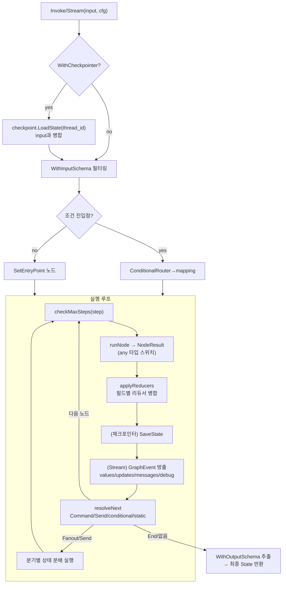

# phase-2 — 그래프 엔진: 분석·설계

## 근거

이 설계는 다음 입력에 근거한다.

- 요구사항: `features/20260628-003-phase-2/spec.md` §1 범위, §3 제약, §4 제외, §5 완료 조건(1~12).
- 전체 명세: `README.md` §7(graph), §7-1(graph/command), §13(streaming), §26 Phase 2, §28-1 import 사이클.
- 기존 코드(Phase 0/1, 의존·재사용 대상, 수정 금지):
  - `core/core.go` — `State`/`StateUpdate` = `map[string]any`, `Mode` + 4개 상수, `StateSnapshot{Values, Next, Config, Metadata, CreatedAt}`.
  - `config/config.go` — `RunConfig{Configurable map[string]any}`, `GetThreadID`/`GetConfigurable`.
  - `checkpoint/checkpoint.go` — `Checkpointer` 인터페이스(`Get`/`Put`/`List`/`DeleteThread`), `InMemorySaver`,
    `Checkpoint{ThreadID, Values, Next, Metadata, CreatedAt, ParentConfig}`, `StateSnapshot = core.StateSnapshot` alias,
    `LoadState`/`SaveState`/`ThreadIDFromConfig`.
  - `message/message.go` — `AddMessages(base, incoming []Message) []Message`(필드 리듀서 예시, graph는 비의존).
  - `prebuilt/prebuilt.go` — 로컬 `NodeFunc func(ctx, core.State)(core.StateUpdate, error)`(Phase 2에서 정합 안 함, 참고만).

확인 사실과 추정을 분리한다.

- (확인) `core.StateSnapshot.Config`는 `config.RunConfig`이고, `checkpoint.StateSnapshot`은 이미 `core.StateSnapshot` alias다.
  → graph도 같은 alias를 쓰면 graph↔checkpoint 순환이 발생하지 않는다.
- (확인) `checkpoint.Checkpointer`는 `core.State`/`core.StateSnapshot`만 다루고 graph를 import하지 않는다.
  → `Compile(WithCheckpointer)`의 graph→checkpoint 단방향이 성립한다.
- (확인) `core.Mode`와 4개 상수(`ModeValues`/`ModeMessages`/`ModeUpdates`/`ModeDebug`)가 이미 존재한다.
  → streaming/graph는 새 Mode 상수를 정의하지 않고 core를 재사용한다.
- (추정) README §7의 `NodeFunc(ctx, State)(any, error)`는 `StateUpdate` 또는 `command.Command`를 반환값으로 받는 다형 시그니처다.
  반환 타입 스위치 경계는 §3 인터페이스에서 확정한다.
- (추정) graph가 message에 의존하지 않으므로, `AddMessages` 같은 메시지 누적은 사용자가 `StateSchema`에 리듀서로 직접 주입하는 모델이다
  (README §2 message 리듀서 절이 "그래프 상태 병합" 예시로 명시).

## 1. 구조

### 1.1 신규 패키지 3개와 의존 방향

Phase 2는 다음 3개 패키지를 신규로 추가하며, Phase 1 패키지는 일절 수정하지 않는다(SPEC §5.1, §5.11).

- `graph` — StateGraph 빌드·컴파일·실행 엔진.
- `graph/command` — 노드 반환으로 제어 흐름+상태 갱신을 함께 표현하는 Command/Send/GraphTarget.
- `streaming` — 스트림 모드(`core.Mode` alias)와 이벤트·방출 헬퍼.

의존 방향은 단방향 트리이며, 순환이 없다(SPEC §5.11, README §28-1 규칙1·4).

```
        config (leaf, 무의존)
          ▲
          │
        core (config에만 의존: State/StateUpdate/Mode/StateSnapshot)
       ▲  ▲  ▲
       │  │  └──────────────┐
       │  └──────┐          │
  command       streaming   checkpoint
   (core만)      (core만)    (core·config만)
       ▲                        ▲
       │                        │
       └─────────  graph  ──────┘
                  (core·config·command·checkpoint 의존,
                   streaming은 import하지 않고 core.Mode만 직접 참조)
```

핵심 경계 규칙(README §28-1을 그대로 적용):

- `graph.State = core.State`, `graph.StateUpdate = core.StateUpdate`, `graph.StateSnapshot = core.StateSnapshot` — 전부 alias.
  graph 시그니처의 스트림 모드 인자는 `core.Mode`를 직접 참조한다(`streaming.Mode`를 쓰지 않는다).
- `command`는 graph를 import하지 않고 `core`만 참조한다. `Goto`/`End`/`ToParent`/`Fanout`의 update 인자는 `core.StateUpdate`.
  → graph↔command 순환을 command→core 단방향으로 끊는다.
- `streaming`은 graph를 import하지 않고 `core`만 참조한다(`Mode = core.Mode` alias,
  `EmitNodeUpdate(core.StateUpdate)`/`EmitStateValue(core.State)`). graph는 streaming을 import하지 않는다.
  → graph↔streaming을 양방향 분리한다(둘 다 core만 공유).
- `graph`는 `command`를 import한다(NodeFunc 반환이 `command.Command`일 수 있으므로). graph→checkpoint도 단방향이다.

### 1.2 graph 패키지 내부 구성

- 빌드: `StateSchema`(필드별 리듀서 맵), `Builder`(노드·엣지·조건엣지·진입점 누적), `Node`/`Edge`/`ConditionalRouter`.
- 컴파일: `Compile`이 `validate`를 거쳐 불변 `Compiled`를 만든다. 컴파일 옵션으로 `WithCheckpointer`(checkpoint 결합).
- 실행: `Compiled`의 `Invoke`/`Stream`/`GetState`/`GetStateHistory`/`UpdateState`.
- 내부: `runNode`/`resolveNext`/`applyReducers`/`validate`/`checkMaxSteps`.
- 시각화: `DrawMermaid`(텍스트만, `DrawMermaidPNG`는 제외 — SPEC §4, §5.12).
- 서브그래프: `Compiled`가 NodeFunc 어댑터로 자기 자신을 부모 그래프의 노드로 등록 가능.

### 1.3 두 이벤트 타입의 역할 분담 (핵심 설계 논점)

README는 `graph.GraphEvent`(§7)와 `streaming.Event`(§13)를 둘 다 정의한다. §28-1이 graph↔streaming을 분리하라고 못박았으므로,
graph가 streaming.Event를 반환 타입으로 쓸 수 없다(import 금지). 따라서 두 타입의 역할을 다음과 같이 분담한다(SPEC §5.8).

- `graph.GraphEvent` — `Compiled.Stream`의 채널 원소 타입(`<-chan GraphEvent`). 그래프 엔진이 실행 루프에서 직접 방출하는,
  엔진 소유의 이벤트다. 노드 이름·모드·페이로드(전체 상태/변경분/토큰/디버그)·서브그래프 경로(path)를 담는다.
  graph는 streaming을 import하지 않으므로 이 타입을 graph 패키지 안에 둔다.
- `streaming.Event` + `Emit*` 헬퍼 — graph 엔진에 묶이지 않은, **호출자·노드 코드가 직접 이벤트를 조립**하기 위한 독립 유틸리티다.
  `EmitNodeUpdate`/`EmitStateValue`/`EmitMessageToken`/`EmitSubgraph`는 core 타입만 받아 `streaming.Event`를 만든다.
  멀티에이전트·RAG 같은 응용 계층(README §14·§17)이 자체 스트림 파이프라인을 구성할 때, 또는 노드 내부에서 토큰 단위
  방출(`messages` 모드)을 직접 만들 때 쓴다.

즉 둘은 중복이 아니라 **소유자가 다르다**: `GraphEvent`는 엔진이 루프에서 생산하는 채널 타입, `streaming.Event`는 호출자가
core 타입으로부터 조립하는 휴대용 이벤트다. 두 타입은 같은 의미축(node/update/value/token/metadata/path)을 공유하되 패키지
경계 때문에 별도로 존재한다. 변환이 필요하면 graph 외부(호출자)에서 `GraphEvent` → `streaming.Event`로 매핑한다(graph는
streaming을 모른다). 이 분리가 §28-1의 graph↔streaming 비순환을 보장한다(SPEC §5.11). 상세 채택 근거는 §5 Decision Point D7.

## 2. 데이터 흐름

### 2.1 그래프 실행 루프 (Invoke)

`Compiled.Invoke`의 제어 흐름은 다음과 같다(SPEC §5.3, §5.4, §5.5, §5.10).

```
Invoke(ctx, input, cfg)
  │
  ├─ (WithCheckpointer 지정 시) checkpoint.LoadState로 thread_id 기존 상태 로드 → input과 병합   [SPEC §5.9]
  ├─ WithInputSchema 지정 시 input을 입력 스키마 필드로 필터링                                    [SPEC §5.6]
  │
  ├─ 시작 노드 결정:
  │     · SetConditionalEntryPoint 있으면 라우터(ctx, state) 실행 → mapping으로 첫 노드 선택       [SPEC §5.4]
  │     · 아니면 SetEntryPoint 노드
  │
  └─ 루프 (step = 0):
        ├─ checkMaxSteps(step): step이 한도 초과면 error 반환(순환 무한 실행 차단)               [SPEC §5.10]
        ├─ res = runNode(ctx, current, state)         // NodeFunc 실행, 반환을 NodeResult로 정규화 [SPEC §5.3]
        ├─ state = applyReducers(state, res.Update)    // 필드별 리듀서로 update 병합              [SPEC §5.3]
        ├─ (체크포인터 지정 시) 현재 state를 thread_id에 SaveState                                 [SPEC §5.9]
        ├─ (Stream 경로면) mode에 따라 GraphEvent 방출(values/updates/messages/debug)             [SPEC §5.8]
        ├─ next = resolveNext(current, res)            // Command/Send/conditional/정적엣지 해석   [SPEC §5.4, §5.5]
        ├─ next가 비었거나 End면 루프 종료
        ├─ next가 여러 개(Fanout/Send)면 각 분기를 실행(분기별 상태 분배)                          [SPEC §5.5]
        └─ step++; current = next
        │
  └─ 종료: WithOutputSchema 지정 시 출력 필드만 추출해 반환, 아니면 전체 state 반환               [SPEC §5.6]
```

### 2.2 NodeFunc 반환의 다형 정규화 (runNode)

`NodeFunc`는 `(ctx, State) (any, error)`다. `runNode`가 반환 `any`를 타입 스위치로 `NodeResult`(엔진 내부 정규형)로 정규화한다
(SPEC §5.3, §5.5).

```
runNode 결과 any의 타입 스위치:
  · command.Command  → NodeResult{Update: cmd.Update, Control: cmd}   // Goto/End/ToParent/Fanout 제어 포함
  · core.StateUpdate → NodeResult{Update: u, Control: 정적 엣지/조건엣지 위임}
  · core.State       → (호환) StateUpdate로 취급 가능 — 단, 표준은 StateUpdate
  · nil              → NodeResult{Update: nil} (변경 없음, 정적/조건 엣지로 진행)
  · 그 외            → error("지원하지 않는 노드 반환 타입")
```

`NodeResult`는 README §7에 등재된 타입이며, `runNode`가 반환하고 `resolveNext`가 소비한다. 이 정규화가 "StateUpdate 반환"과
"Command 반환"을 하나의 루프에서 일관되게 처리하는 경계다(논점 2).

### 2.3 다음 노드 결정 (resolveNext)

`resolveNext(name, res)`의 우선순위(SPEC §5.4, §5.5):

1. `res.Control`이 Command인 경우:
   - `End` → 종료(다음 노드 없음).
   - `Goto(target)` → 현재 그래프의 target 노드로 이동. target은 해당 노드의 `WithDestinations`에 선언돼 있어야 validate 통과.
   - `ToParent(target)` → 부모 그래프 대상으로 이동(서브그래프 맥락에서만 유효, §2.5).
   - `Fanout([]Send)` → 다중 분기. 각 Send의 Target으로 분기하며 Send.State를 그 분기 상태로 분배(부모 대상 가능).
2. Command가 아니면(StateUpdate 반환) 정적 엣지·조건엣지로 결정:
   - `AddConditionalEdges(from, router, mapping)`가 있으면 `router(ctx, state)` 키를 mapping으로 노드 이름에 매핑.
   - 아니면 `AddEdge(from, to)`의 정적 to.

### 2.4 상태 리듀서 병합 (applyReducers)

`StateSchema`는 필드명 → 리듀서 함수 맵을 보유한다. `applyReducers(state, update)`는 update의 각 키에 대해(SPEC §5.3):

- 그 필드에 등록된 리듀서가 있으면 `reducer(state[key], update[key])`로 병합(예: 사용자가 주입한 `AddMessages` 래퍼로 메시지 누적).
- 없으면 last-write-wins(덮어쓰기, 기본 리듀서).

graph는 message를 import하지 않는다. `AddMessages` 같은 도메인 리듀서는 사용자가 `StateSchema`에 함수로 등록해 주입한다
(논점 4, README §2 message 리듀서 절). 이로써 graph는 도메인 비의존 범용 엔진이 된다(SPEC §5.2).

### 2.5 서브그래프 흐름

컴파일된 `Compiled`를 NodeFunc 어댑터로 감싸 부모 그래프의 노드로 등록한다(SPEC §5.7).

- 상태 공유 모드: 부모 상태를 서브그래프에 그대로 넘기고, 서브그래프 종료 상태를 부모 update로 반환.
- 독립 상태 모드: 부모 상태에서 서브그래프 입력 스키마(WithInputSchema)로 필터한 부분만 넘기고, 출력 스키마로 추출한 결과만
  부모에 반환.
- `ToParent(target)` / 부모 대상 `Send`: 서브그래프 노드가 부모 그래프의 노드로 직접 라우팅하는 경로다. `GraphTarget`(current/parent)이
  Send/Command의 대상 그래프를 가린다(SPEC §5.5).

### 2.6 스트림 흐름과 모드별 방출

`Stream(ctx, input, cfg, mode core.Mode)`는 Invoke와 같은 루프를 돌되 단계마다 `GraphEvent`를 채널로 방출한다(SPEC §5.8).

- `values` — 노드 실행 후 전체 상태 스냅샷.
- `updates` — 노드별 변경분(applyReducers 입력 update).
- `messages` — 토큰 단위(노드가 `streaming.EmitMessageToken`으로 만든 토큰을 엔진이 GraphEvent로 중계).
- `debug` — 진단 이벤트(노드 진입/이탈, 라우팅 결정 등).
- `Subgraphs` 옵션(streaming.Options 또는 Stream 옵션)이 켜지면 서브그래프 이벤트가 경로(path)와 함께 전파된다
  (`EmitSubgraph(path, inner)` 의미축을 GraphEvent.Path로 반영).

### 2.7 데이터 흐름 다이어그램 (Mermaid)



## 3. 인터페이스

신규 정의만 기술한다(기존 타입은 §근거 참조). 시그니처는 README §7·§7-1·§13을 기준으로 하며, §28-1대로 경계만 유지하면
세부는 구현 시 조정 가능하다.

### 3.1 graph 패키지

```go
// alias (§28-1 규칙1) — 새 타입을 만들지 않고 core를 재노출
type State = core.State
type StateUpdate = core.StateUpdate
type StateSnapshot = core.StateSnapshot

// 노드·라우터
type NodeFunc func(ctx context.Context, st State) (any, error)   // 반환: StateUpdate 또는 command.Command
type ConditionalRouter func(ctx context.Context, st State) string

// 스키마·빌더·컴파일
type StateSchema struct { /* 필드명 → 리듀서 함수 맵 */ }
func NewStateGraph(schema StateSchema, opts ...SchemaOption) *Builder  // WithInputSchema/WithOutputSchema
func (b *Builder) AddNode(name string, fn NodeFunc, opts ...NodeOption) error  // WithDestinations(...)
func (b *Builder) AddEdge(from, to string) error
func (b *Builder) AddConditionalEdges(from string, router ConditionalRouter, mapping map[string]string) error
func (b *Builder) SetEntryPoint(name string) error
func (b *Builder) SetConditionalEntryPoint(router ConditionalRouter, mapping map[string]string) error
func (b *Builder) Compile(opts ...CompileOption) (*Compiled, error)   // WithCheckpointer

// 실행 (스트림 모드 인자는 core.Mode 직접 참조)
func (c *Compiled) Invoke(ctx context.Context, input State, cfg config.RunConfig) (State, error)
func (c *Compiled) Stream(ctx context.Context, input State, cfg config.RunConfig, mode core.Mode) (<-chan GraphEvent, error)
func (c *Compiled) GetState(cfg config.RunConfig) (StateSnapshot, error)
func (c *Compiled) GetStateHistory(cfg config.RunConfig) ([]StateSnapshot, error)
func (c *Compiled) UpdateState(cfg config.RunConfig, update StateUpdate) error
func (c *Compiled) DrawMermaid() string

// 이벤트·내부 정규형
type GraphEvent struct { /* Node, Mode, Update, Value, Token, Metadata, Path */ }
type NodeResult struct { /* Update StateUpdate; Control *command.Command (nil이면 엣지 위임) */ }
```

옵션 함수: `WithInputSchema`/`WithOutputSchema`(SchemaOption), `WithDestinations`(NodeOption), `WithCheckpointer`(CompileOption).
`DrawMermaidPNG`는 정의하지 않는다(SPEC §4, §5.12).

### 3.2 graph/command 패키지 (core만 의존)

```go
type GraphTarget string
const ( TargetCurrent GraphTarget = "current"; TargetParent GraphTarget = "parent" )

type Send struct { Target string; State any; Graph GraphTarget }
type Command struct { Goto string; Update core.StateUpdate; Graph GraphTarget; Sends []Send /* + End 표식 */ }

func Goto(target string, update core.StateUpdate) Command
func End(update core.StateUpdate) Command
func ToParent(target string, update core.StateUpdate) Command
func Fanout(sends []Send) Command           // 다중 분기(부모 대상 Send 가능)
func NewSend(target string, st any) Send
func (c Command) IsEnd() bool
func (c Command) IsParent() bool
```

command는 graph를 import하지 않는다(update는 `core.StateUpdate`). graph가 command를 import한다.

### 3.3 streaming 패키지 (core만 의존)

```go
type Mode = core.Mode                       // alias, 상수는 core.ModeValues 등 재사용
type Metadata map[string]any
type Event struct { Node string; Update core.StateUpdate; Value core.State; Token string; Metadata Metadata; Path []string }
type Options struct { Mode core.Mode; Subgraphs bool }

func EmitNodeUpdate(node string, update core.StateUpdate) Event
func EmitStateValue(st core.State) Event
func EmitMessageToken(token string, md Metadata) Event
func EmitSubgraph(path []string, inner Event) Event
```

streaming은 graph를 import하지 않으며 graph도 streaming을 import하지 않는다(§1.3, D7).

## 4. 영향 범위

- **신규 생성** (전부 추가, 기존 미수정):
  - `graph/graph.go`(+분할 시 `builder.go`/`compiled.go`/`exec.go`/`mermaid.go` 등) — graph 패키지 전체.
  - `graph/command/command.go` — command 서브패키지.
  - `streaming/streaming.go` — streaming 패키지.
  - 각 패키지 검증용 `_test.go`(stub 노드 기반, 네트워크/API 키 불필요 — SPEC §4, §5).
- **기존 호출자/마이그레이션**: 해당 없음. Phase 1 패키지(`agent`/`prebuilt`/`checkpoint`/`message`/`llm`/`tool` 등)는
  수정하지 않으며, agent는 Phase 1 직접 루프를 유지한다. prebuilt 노드를 graph.NodeFunc로 정합시키는 통합은 deferred(SPEC §4).
- **의존 결합점**: graph가 `core`(타입 alias)·`config`(RunConfig)·`command`(import)·`checkpoint`(WithCheckpointer 결합)를 참조한다.
  이 결합은 모두 기존 공개 API만 사용하며 대상 패키지 코드를 바꾸지 않는다.
- **검증 방법**: import 그래프 검사(`go list -deps`/`go mod graph` 또는 패키지 import 점검)로 command·streaming이 graph 비참조,
  graph가 command 참조임을 확인(SPEC §5.11). `go build ./...`/`go vet ./...` 무오류(SPEC §5.1). stub 노드 그래프로
  Invoke/Stream/조건엣지/Command/서브그래프/체크포인터 영속/maxSteps/DrawMermaid를 단위 테스트(SPEC §5.2~§5.12).

## 5. Decision Points

아래는 spec.md의 "이미 확정된 결정"을 채택안으로 반영한 항목과, 설계상 commit이 필요한 항목이다. 새로 사용자 결정이
필요한 미해결 지점은 없다.

### D1. 세 패키지 경계와 의존 방향 — 채택: core 중심 단방향 트리

graph.State/StateUpdate/StateSnapshot은 core alias, 스트림 모드는 core.Mode 직접 참조. command·streaming은 core만 참조,
graph는 command를 import. graph→checkpoint 단방향(WithCheckpointer). (SPEC §5.1, §5.11, README §28-1)
근거: §28-1이 명시한 유일한 비순환 구성이며, checkpoint.StateSnapshot이 이미 core alias라 추가 변경 없이 성립한다.

### D2. NodeFunc 다형 반환 — 채택: `(any, error)` + runNode 타입 스위치

NodeFunc 반환을 `any`로 두고 runNode가 `command.Command`/`core.StateUpdate`/`nil`로 분기해 NodeResult로 정규화. 지원하지 않는
타입은 error. (SPEC §5.3, §5.5)
근거: README §7 시그니처와 일치. StateUpdate 노드와 Command 노드를 한 루프에서 처리하는 최소 경계.
대안(제네릭 두 시그니처 분리)은 README 시그니처에서 벗어나고 빌더 API가 갈라져 기각.

### D3. 실행 모델 — 채택: 진입점→runNode→applyReducers→resolveNext 루프 + checkMaxSteps

조건 진입점/조건엣지를 라우터+mapping으로 해석, Fanout/Send는 분기 실행, maxSteps로 순환 차단. validate가 도달 불가
노드·미정의 엣지를 컴파일 시 거부. (SPEC §5.2, §5.3, §5.4, §5.10)

### D4. 상태 리듀서 — 채택: StateSchema 필드별 리듀서, 미등록 필드는 last-write-wins

도메인 리듀서(AddMessages 등)는 사용자가 StateSchema에 주입. graph는 message 비의존. (SPEC §5.3, README §2)
근거: graph를 도메인 중립 범용 엔진으로 유지(SPEC §5.2)하고 graph→message 의존을 만들지 않음.

### D5. command 제어 흐름 — 채택: Goto/End/ToParent/Fanout/Send + GraphTarget(current/parent)

Command 구조에 Goto/Update/Graph/Sends 필드. Fanout이 []Send로 다중 분기, 각 Send가 분기별 State 분배, ToParent/parent
Send는 서브그래프→부모 라우팅. (SPEC §5.5, README §7-1)

### D6. 서브그래프 — 채택: Compiled를 NodeFunc 어댑터로 등록, 상태 공유/독립 둘 다 지원

독립 모드는 WithInputSchema/WithOutputSchema로 입출력 경계를 가린다. ToParent/parent Send가 부모 라우팅 경로.
(SPEC §5.6, §5.7)

### D7. 두 이벤트 타입 — 채택: graph.GraphEvent(엔진 채널 소유) + streaming.Event(호출자 조립용), 분리 유지

graph.Stream은 graph.GraphEvent 채널을 반환한다. streaming.Event/Emit* 헬퍼는 graph에 묶이지 않은 독립 유틸리티로,
core 타입만 받아 응용 계층이 자체 스트림을 조립하거나 노드가 토큰을 방출할 때 쓴다. graph는 streaming을 import하지 않고,
변환이 필요하면 graph 외부에서 매핑한다. (SPEC §5.8, §5.11, README §7·§13·§28-1)
근거: §28-1이 graph↔streaming 분리를 강제하므로 graph가 streaming.Event를 반환 타입으로 쓸 수 없다. 두 타입은 의미축은
같지만 소유 패키지와 용도가 다르므로 중복이 아니라 역할 분담이다. 이것이 이 Phase의 핵심 설계 논점이며, 다른 구성
(streaming.Event 단일 사용)은 import 순환을 만들어 기각.

### D8. 상태 조회·체크포인트 — 채택: GetState/GetStateHistory/UpdateState + WithCheckpointer로 checkpoint 결합

StateSnapshot은 core alias. WithCheckpointer 지정 시 동일 thread_id에서 Invoke 호출 간 상태 영속. checkpoint.LoadState/
SaveState/List를 그대로 사용(새 백엔드 없음). (SPEC §5.9, SPEC §4)

### D9. 입출력 스키마 분리 — 채택: WithInputSchema/WithOutputSchema 옵션

입력 필터링·출력 추출을 Invoke 시작/종료와 서브그래프 경계에서 적용. (SPEC §5.6)

### D10. mermaid 텍스트 — 채택: DrawMermaid만, DrawMermaidPNG 제외

DrawMermaid가 컴파일 그래프를 mermaid 문자열로 렌더. PNG는 외부 렌더 의존 회피로 제외. (SPEC §4, §5.12)

### D11. 검증 방식 — 채택: stub 노드 단위 테스트 + import 그래프 검사

정해진 StateUpdate/Command를 반환하는 stub 노드로 네트워크 없이 전 동작 검증. import 검사로 §5.11 경계 확인. (SPEC §4, §5.11)
