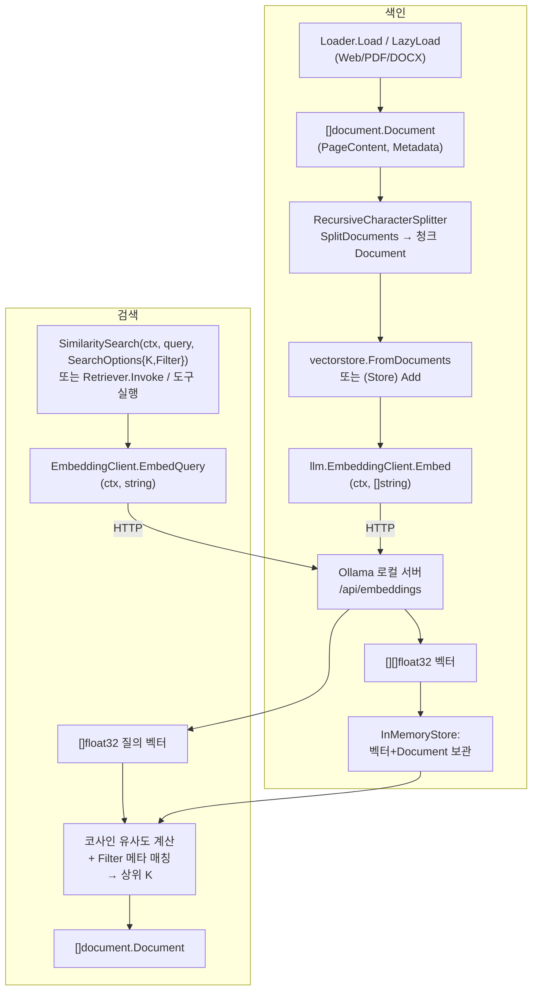

# phase-3 — 문서·벡터스토어 ANALYSIS

## 승인 전 확인

- Ollama 부재 환경에서 임베딩·검색 검증을 건너뛰는(skip) 채택안(§5 D6)이, "실제 Ollama 호출로
  검증하되 CI에서 빌드·정적검사는 막지 않는다"는 의도와 맞는지. 관련 본문: §2, §5
- 기본 임베딩 모델을 `nomic-embed-text`로 두고 `InitEmbeddings("ollama:nomic-embed-text")`로 명시
  지정도 허용하는 채택안(§5 D7)이, 이 Phase의 의도(로컬 임베딩 동작 확인)와 맞는지. 관련 본문: §3, §5

## 근거

읽은 spec.md 범위: 전체(§승인 전 확인, §1 범위, §2 목표, §3 제약, §4 제외 범위, §5 완료 조건 1~9).

코드베이스에서 확인한 사실:

- `llm/llm.go`: `Client` 인터페이스, `InitChatModel(spec, opts...)`, `parseProviderSpec`가
  `"provider:model"`을 `SplitN(...,":",2)`로 파싱하고 형식 오류·빈 provider/model을 error로 거부한다.
  `Option`/`clientOptions`(`apiKey`/`defaultModel`)와 `WithAPIKey`/`WithDefaultModel` 옵션 빌더가
  있다. 임베딩 타입·팩토리는 미구현이며, 파일 헤더 주석이 "임베딩 타입·팩토리는 Phase 3 범위"라고
  명시한다.
- `llm/anthropic_adapter.go`: `newAnthropicClient`가 `default` 분기에서 호출되는 구조이고, 실제
  네트워크 호출은 Anthropic SDK가 담당한다. `llm` 패키지에 런타임 `net/http` 직접 사용 코드는 없다(테스트
  파일 제외). Ollama 임베딩은 HTTP 호출을 `llm`에 새로 들인다.
- `llm/stub.go`: `StubClient`는 챗 `Client` 전용 테스트 stub이며 임베딩과 무관하다. spec.md §3대로
  기존 챗 `Client`/`StubClient`/어댑터 동작은 바꾸지 않는다.
- `tool/tool.go`: `Tool` 인터페이스(`Name`/`Description`/`Schema`/`Execute(ctx, Input, Runtime)`),
  `Schema`(Name/Description/[]Parameter), `Parameter`(Name/Type/Description/Required), `Result`
  (Content/IsError), `Input = json.RawMessage`, `Runtime` 인터페이스, `FromFunc`/`WithArgsSchema`
  (Go 함수→Tool 변환, 구조체 태그에서 스키마 도출)가 있다. `CreateRetrieverTool`이 반환할
  `tool.Tool`은 이 인터페이스를 충족하면 되고, `WithArgsSchema`로 질의 인자 구조체를 받는 도구를 만들 수
  있다.
- import 경계(README §28-1, Phase 0 토대 주석): `config`(leaf) ← `core` ← `message` ← (`llm`/`tool`/
  `structured`/`prompt`) 순의 상위→하위 단방향. `tool`은 `config`/`message`에만 의존하고 `store`/
  `trace` 구체를 참조하지 않는다. `llm`은 `message`/`structured`/`tool`/`core`에 의존한다. 이 구조에서
  `vectorstore`가 `document`/`llm`/`tool`을 import하고 그 역참조가 없으면 단방향이 유지된다.
- `go.mod`: 현재 외부 의존은 Anthropic SDK와 그 간접 의존, `golang.org/x/sync`뿐이다. Web/PDF/DOCX
  파싱 라이브러리는 없으므로 §4·§5대로 새 의존성을 추가해야 한다.
- README §4·§15·§16: 임베딩 팩토리·document·vectorstore 시그니처 초안을 확인했다. 단 README는
  `InitEmbeddings`를 OpenAI로, vectorstore에 Chroma/Supabase 백엔드를 포함해 기술하나, spec.md §3·§4가
  이 Phase를 Ollama 임베딩 + InMemoryStore로 좁혔다. ANALYSIS는 spec.md 범위를 따른다(README 초안 중
  OpenAI·Chroma·Supabase·`MatchDocuments`·`NewChromaStore`·`NewSupabaseVectorStore`는 제외).

추정(확인 사실과 구분): Ollama 임베딩 엔드포인트는 로컬 HTTP API(`/api/embeddings` 또는 `/api/embed`)
이며, 기본 베이스 URL은 `http://localhost:11434`이다. 정확한 엔드포인트·요청/응답 스키마는 구현 시점에
설치된 Ollama 버전 기준으로 확정한다.

## 1. 구조

세 경계로 나눈다.

- `llm` 패키지 내 임베딩 추가(기존 패키지 확장): `EmbeddingClient` 인터페이스, `InitEmbeddings`
  팩토리, Ollama 임베딩 구현체를 추가한다. 기존 챗 경계(`Client`/어댑터/stub)와는 별도의 파일로 분리해
  공존시키되, `"provider:model"` 파싱·옵션 빌더 규약은 `InitChatModel`과 같은 형태를 따른다(SPEC §5.2).
  Ollama 호출은 표준 `net/http` 기반 경량 클라이언트로 직접 구현하고, 추가 SDK 의존은 두지 않는다(§5 D1).
- `document` 패키지(신규 leaf): `Document`(PageContent, Metadata) 값 타입, `Loader` 인터페이스와
  Web/PDF/DOCX 로더 구현, `TextSplitter` 인터페이스와 재귀적 문자 분할기를 둔다. 모듈 내 상위 패키지를
  import하지 않는다 — 외부 파싱 라이브러리와 표준 라이브러리에만 의존한다(SPEC §5.3, §5.9). PDF/DOCX/Web
  본문 추출이 각각 외부 의존을 들이므로, 로더는 파서별 어댑터를 감싸는 형태로 둔다.
- `vectorstore` 패키지(신규 상위): `Store`/`Retriever` 인터페이스, 인메모리 구현체(`InMemoryStore`),
  `SearchOptions`(K, Filter), `FromDocuments`/`StoreOption` 생성 경로, retriever 도구화
  `CreateRetrieverTool`을 둔다. `document`(`document.Document`), `llm`(`llm.EmbeddingClient`),
  `tool`(`tool.Tool`)에 의존하는 최상위 조립 지점이다(SPEC §5.5~§5.7, §5.9). ChromaStore·
  SupabaseVectorStore는 두지 않는다(§4, §5 D3).

기존 모듈 안에서 끝나는 변경은 임베딩뿐이므로 `llm`에 새 레이어를 만들지 않고 같은 패키지에 파일만
추가한다. `document`/`vectorstore`는 spec.md가 신설을 요구하는 새 경계라 별 패키지로 둔다.

## 2. 데이터 흐름

색인(indexing)과 검색(query) 두 경로가 있고, 둘 다 임베딩 단계에서 Ollama HTTP로 나간다.

경로 상세:

- 적재: `Loader.Load(ctx)`는 전량을 `[]Document`로, `LazyLoad(ctx)`는 채널로 흘린다(SPEC §5.3). Web은
  URL 본문, PDF는 페이지별 Document와 메타(page/source/total_pages), DOCX는 문서 텍스트를 만든다.
  `ReadPDFBytes(b)`는 파일 경로 없이 바이트에서 텍스트를 추출하는 우회 진입점이다.
- 분할: `SplitDocuments`는 각 Document의 PageContent를 `SplitText`로 청크화하고 Metadata를 청크에
  전파한다. overlap이 인접 청크 경계에 반영된다(SPEC §5.4).
- 색인: `FromDocuments`/`Add`가 청크 텍스트를 모아 `EmbeddingClient.Embed`로 한 번에 임베딩하고,
  벡터·Document·Metadata를 InMemoryStore에 보관한다(SPEC §5.5).
- 검색: `SimilaritySearch`는 `EmbedQuery`로 질의 벡터를 만들고 보관된 벡터와 유사도를 계산해 상위 K개를
  반환하며, `Filter`가 있으면 Metadata 일치 항목으로 한정한다(SPEC §5.5). `AsRetriever`+`Invoke`는 같은
  검색을 SearchOptions 고정 형태로 감싼다(SPEC §5.6). `CreateRetrieverTool`이 만든 도구는 질의 인자를
  받아 검색 결과를 도구 출력 텍스트로 직렬화한다(SPEC §5.7).

외부 통합·에러 경로:

- Ollama HTTP: 연결 실패·비정상 상태코드·빈 임베딩 응답은 `Embed`/`EmbedQuery`가 error로 올린다. 색인/
  검색 호출자에게 그대로 전파된다.
- 파싱: 잘못된 경로·미지원 형식·파서 실패는 로더가 error로 반환한다. `LazyLoad` 채널 경로의 실패 전달
  방식(채널 종료 vs 에러 동반)은 §5 D4에서 정한다.
- 형식 오류 spec·미지원 프로바이더: `InitEmbeddings`가 즉시 error로 거부한다(SPEC §5.2).

## 3. 인터페이스

경계를 가로지르는 계약만 둔다(내부 helper·유사도 계산 함수 등 제외).

llm(임베딩):

- `InitEmbeddings(spec string) (EmbeddingClient, error)` — `"ollama:<model>"` 파싱, `ollama` 분기만
  구현, 그 외 프로바이더·형식 오류는 error(SPEC §5.2). 옵션 빌더가 필요하면 `InitChatModel`과 같은
  `Option` 규약을 재사용한다(베이스 URL 지정 등 — §5 D2).
- `EmbeddingClient` 인터페이스:
  - `Embed(ctx context.Context, texts []string) ([][]float32, error)`
  - `EmbedQuery(ctx context.Context, text string) ([]float32, error)`

document:

- `Document` 구조(`PageContent string`, `Metadata map[string]any` 형태의 값 타입).
- `Loader` 인터페이스:
  - `Load(ctx context.Context) ([]Document, error)`
  - `LazyLoad(ctx context.Context) (<-chan Document, error)`
- 로더 생성자: `NewWebLoader(urls []string) Loader`, `NewPDFLoader(path string) Loader`,
  `NewDocxLoader(path string) Loader`.
- `ReadPDFBytes(b []byte) (string, error)`.
- `TextSplitter` 인터페이스: `SplitDocuments([]Document) []Document`, `SplitText(string) []string`.
- `NewRecursiveCharacterSplitter(chunkSize, overlap int) TextSplitter`.

vectorstore:

- `Store` 인터페이스:
  - `Add(ctx context.Context, docs []document.Document) error`
  - `SimilaritySearch(ctx context.Context, query string, opts SearchOptions) ([]document.Document, error)`
  - `AsRetriever(opts SearchOptions) Retriever`
- `Retriever` 인터페이스: `Invoke(ctx context.Context, query string) ([]document.Document, error)`.
- `SearchOptions` 구조(`K int`, `Filter map[string]any`).
- `FromDocuments(ctx context.Context, docs []document.Document, emb llm.EmbeddingClient, opts ...StoreOption) (Store, error)`
  와 `StoreOption` 빌더.
- `CreateRetrieverTool(r Retriever, name, description string) tool.Tool` — 반환 도구는 `tool.Tool`
  계약(`Schema`로 질의 파라미터 노출, `Execute`에서 `Invoke` 호출 후 결과를 `tool.Result.Content`로
  직렬화)을 충족한다(SPEC §5.7).

## 4. 영향 범위

건드리는 기존 모듈:

- `llm` 패키지: `EmbeddingClient`/`InitEmbeddings`/`Embed`/`EmbedQuery`와 Ollama 구현체 추가. 기존
  챗 `Client`·`StubClient`·어댑터는 수정하지 않는다(spec.md §3). 의존 탐색 결과 임베딩 심볼을 참조하는
  기존 호출자는 없다(`InitEmbeddings`/`EmbeddingClient`는 코드에 미존재, 첫 소비처가 이 Phase의
  `vectorstore`). 따라서 기존 호출자 파급은 없고 순수 추가다.
- `go.mod`: Web/PDF/DOCX 파싱 외부 의존성 추가(구체 라이브러리는 §5 D5). Ollama HTTP는 표준
  `net/http`로 처리해 추가 의존을 두지 않는다(§5 D1).

신규(영향 아님): `document`/`vectorstore` 패키지 신설.

수정 금지(spec.md §3 재확인): `config`/`core`/`message`/`tool`/`structured`/`prompt`/`agent`/
`middleware`/`prebuilt`/`checkpoint`/`graph`/`graph/command`/`streaming`. `tool`은 `vectorstore`가
import만 하고 수정하지 않으므로 역참조가 생기지 않는다(SPEC §5.9).

하위 호환·마이그레이션: 해당 없음(기존 호출자·저장 데이터·외부 contract가 깨지지 않는 순수 추가).

## 5. Decision Points

### D1. Ollama 임베딩 호출 방식 — 직접 HTTP vs 외부 클라이언트 라이브러리

- 옵션: (a) 표준 `net/http`로 Ollama 임베딩 엔드포인트 직접 호출, (b) Ollama Go 클라이언트 라이브러리
  의존 추가.
- 트레이드오프: (a)는 의존성 0, 요청/응답 스키마가 단순(텍스트 입력→벡터 출력)해 직접 구현 부담이 작고
  `llm`의 기존 무(無)SDK 호출 패턴(챗만 SDK)과 분리 유지. (b)는 엔드포인트 변경 대응을 라이브러리에
  맡기나 의존이 늘고 이 Phase 범위(임베딩 한 종) 대비 과하다.
- 채택: (a) 직접 HTTP. 근거: 임베딩 호출 표면이 작아 추상화 이득이 없고 의존을 늘리지 않는다. 직접 구현을
  기본값으로 commit한다.

### D2. 임베딩 베이스 URL·옵션 주입 방식

- 옵션: (a) `InitChatModel`의 `Option`/`WithAPIKey`/`WithDefaultModel` 규약을 재사용해
  `InitEmbeddings(spec, opts...)`로 베이스 URL 등을 주입, (b) 환경변수(`OLLAMA_HOST` 등) 전용, (c)
  고정 `http://localhost:11434`만.
- 트레이드오프: (a)는 기존 팩토리 규약과 일관되고 테스트에서 로컬 서버 주소를 주입하기 쉽다. (b)는 호출
  코드가 깔끔하나 명시 주입이 안 돼 테스트 격리가 약하다. (c)는 가장 단순하나 비표준 포트·원격 Ollama를
  못 받는다.
- 채택: (a)를 기본으로 하되 베이스 URL 미지정 시 `http://localhost:11434` 기본값. 근거: 기존 옵션 빌더
  패턴과 일관되고 검증 환경 주입이 용이하다. 환경변수 지원 여부는 implement에서 옵션 기본값으로 흡수
  가능하므로 여기서 강제하지 않는다.

### D3. 벡터 백엔드 범위 — InMemoryStore까지

- 옵션: (a) InMemoryStore만, (b) Chroma/Supabase 백엔드까지.
- 트레이드오프: (b)는 README 초안이 언급하나 spec.md §4가 Chroma(persist_directory Go 직접 접근 곤란)와
  Supabase(`database.Client` Phase 7 의존)를 명시 제외했다.
- 채택: (a) InMemoryStore만. `Store`/`Retriever`는 인터페이스로 두어 후속 백엔드 확장 자리는 남기되
  구현은 인메모리 하나만 commit한다(SPEC §5.5). 근거: spec.md 제외 범위 준수.

### D4. LazyLoad 채널의 에러 전달 형태

- 옵션: (a) `LazyLoad`가 즉시 발생 가능한 셋업 에러는 반환값 error로, 적재 중 에러는 채널을 닫아
  종료(부분 결과까지 흘림), (b) 에러 전용 채널/래퍼 타입을 따로 두기.
- 트레이드오프: (a)는 시그니처(`(<-chan Document, error)`)에 부합하고 단순하다. (b)는 항목별 에러를
  세밀히 전달하나 spec.md가 요구하지 않는 복잡도를 들인다.
- 채택: (a). 근거: spec.md §5.3은 `Load`/`LazyLoad` 두 경로 동작만 요구하며, 정해진 시그니처에 맞는 가장
  단순한 전달이 충분하다. 직접 구현을 기본값으로 둔다.

### D5. PDF/DOCX/Web 파싱 라이브러리 선정

- 옵션: 각 형식별 Go 파서 후보(예: HTML 본문 추출, PDF 텍스트 추출, DOCX(ZIP+XML) 추출) 중 택1씩. 구체
  후보는 implement 직전 go.mod 호환·유지보수 상태 조사로 확정.
- 트레이드오프: 라이브러리 성숙도·라이선스·유지보수 활성도가 갈리고, PDF는 페이지 단위 추출(메타
  page/total_pages 산출)을 지원하는지가 추가 조건이다. ANALYSIS 시점 고정은 조사 비용을 앞당기나, 선정
  근거(버전 호환·활성도)는 구현 직전이 더 정확하다.
- 채택: 라이브러리 후보 조사·확정을 implement 단계 직전으로 위임하고, ANALYSIS는 "형식별 외부 파서를
  도입하되 PDF는 페이지별 추출 가능한 것을 고른다"는 기준만 commit한다(SPEC §5.3). 외부 의존 추가 자체는
  spec.md §3이 허용했음을 전제한다(사용자 확인 완료 — implement 직전 조사 위임).

### D6. Ollama 부재 환경(CI)에서의 임베딩·검색 검증 처리 [spec.md 승인 전 확인 1]

- 옵션: (a) 임베딩·검색 테스트는 Ollama 서버 도달 가능할 때만 실행하고, 미도달 시 `t.Skip`으로
  건너뛴다(빌드·`go vet`·임베딩 무관 테스트는 항상 실행), (b) 검증 환경에서 Ollama 가용을 전제로 못 박고
  미가용 환경을 배제, (c) stub 임베딩으로 대체.
- 트레이드오프: (a)는 CI에서 `go build ./...`/`go vet ./...`(SPEC §5.1)와 파싱·분할(§5.3·§5.4) 검증은
  유지하면서 Ollama 의존 검증만 격리해, 로컬에서 실제 서버로 의미 검색(§5.8)을 확인할 수 있다. (b)는
  CI에 Ollama 상시 구동을 요구해 비용·복잡도가 크다. (c)는 spec.md §3이 명시 금지("stub 임베딩으로
  대체하지 않는다").
- 채택: (a) skip 방식. 근거: spec.md §3의 "실제 Ollama 검증" 요구와 §5.1의 "빌드·정적검사는 항상 통과"를
  동시에 만족한다. 의미 검색(§5.8)은 Ollama 가용 환경(로컬)에서 관찰한다.

### D7. 기본 임베딩 모델 `nomic-embed-text` [spec.md 승인 전 확인 2]

- 옵션: (a) 기본 `nomic-embed-text`, `"ollama:<model>"`로 명시 모델 지정 허용, (b) 다른 Ollama 임베딩
  모델을 기본으로.
- 트레이드오프: `nomic-embed-text`는 Ollama에서 임베딩 전용으로 널리 쓰이고 spec.md가 기본값으로 가정한
  모델이다. 다른 기본값은 추가 근거가 없다.
- 채택: (a) 기본 `nomic-embed-text` + 명시 지정 허용. 근거: spec.md §3 가정과 일치하며, 모델 지정 경로를
  열어 두면 다른 임베딩 모델로 전환 시 호출만 바꾸면 된다(SPEC §5.2·§5.8).
