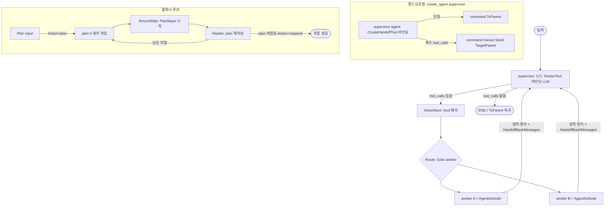

# phase-4 — 멀티에이전트 분석·설계

## 승인 전 확인

- 라우팅·핸드오프 헬퍼(`SelectNext`/`Route`/`MergeWorkerResult`)를 README §14가 `agent.State` 위에서 정의했지만, 실제
  그래프 노드는 `core.State`(map) 위에서 동작하고 `agent.State`는 `Messages`/`StructuredResponse` 2필드만 노출한다.
  이 작업에서 헬퍼를 `graph.State`(=`core.State`) 위에서 정의하고 메시지 추출은 `message` 헬퍼로 처리하는 방향이
  의도와 맞는지(README 시그니처의 `agent.State`는 "라우팅이 보는 대화 상태"의 개념 표기로 해석). 관련 본문: §3, §5.1
- 플래너 구조화 출력 스키마를 `multiagent`에 새로 두지 않고 이미 존재하는 `structured.PlannerResult`/`structured.Plan`/
  `structured.ConversationalResponse`/`structured.RouterChoice`를 그대로 소비하는 방향이 의도와 맞는지(§3가 "새 타입이
  필요하면 multiagent에 둔다"고 했으나, 필요한 타입이 이미 structured에 있음을 확인). 관련 본문: §4, §5.6

## 근거

확인한 spec.md 범위: §1~§5 전체.

코드베이스 확인 사실(실제 읽은 파일 기준):

- `structured/schemas.go`: 플래너용 타입이 **이미 모두 존재**한다 — `PlannerResult{Action, Plan *Plan, Response
  *ConversationalResponse}`, `Plan{Steps []string}`, `ConversationalResponse{Response string}`,
  `PlannerAction`(`plan`/`respond`), `PlannerResultSchema()`, `PlanSchema()`, 그리고 라우터용 `RouterChoice[T]`/
  `RouterChoiceSchema(allowed...)`. 따라서 플래너·라우터 구조화 스키마를 `multiagent`에 새로 만들 필요가 없다(추정 아님,
  파일 확인). README §14도 `Plan(ctx, input) (structured.PlannerResult, error)`로 structured 타입을 명시 참조한다.
- `agent/agent.go`: `agent.Agent`는 `Invoke(ctx, Input, config.RunConfig) (Result, error)`,
  `Stream(ctx, Input, config.RunConfig, core.Mode) (<-chan AgentEvent, error)`, `GetState(config.RunConfig)`를
  노출한다. `Input{Messages []message.Message}`, `Result{Messages []message.Message, StructuredResponse any}`.
  `agent.State`는 비공개로 쓰이는 2필드 구조체이며 `core.State` map과는 `toCoreState`/`stateFromCore`로만 오간다.
  agent는 graph/command를 import하지 않는다(주석 명시, §28-1 규칙1).
- `graph/graph.go`·`graph/builder.go`·`graph/compiled.go`: `NodeFunc = func(ctx, State) (any, error)`이고
  반환 any를 `StateUpdate` 또는 `command.Command`로 타입스위치한다. 빌드 표면은 `NewStateGraph`/`AddNode`(+
  `WithDestinations`)/`AddEdge`/`AddConditionalEdges`/`SetEntryPoint`/`SetConditionalEntryPoint`/`Compile`. `State`/
  `StateUpdate`는 `core.State`/`core.StateUpdate`의 alias. `AddSubgraphNode`와 `Compiled.AsNode()`가 이미 서브그래프를
  노드로 감싸는 어댑터를 제공한다.
- `graph/command/command.go`: `Command`(Goto/End/ToParent/Fanout 생성자, `IsEnd`/`IsParent` 판별), `Send{Target,
  State any, Graph}`, `NewSend`. `ToParent`는 `Graph=TargetParent`로 부모 그래프 노드를 가리키고, `Fanout([]Send)`는
  각 Send가 `TargetParent`도 될 수 있다. `graph/subgraph.go`가 ToParent/parent-Send를 부모 루프로 전파함을 확인.
- `tool/tool.go`: `Tool`(Name/Description/Schema/Execute), `Runtime`(State()/ToolCallID()/Config()/Store()/Emit()),
  `FromFunc`/`WithArgsSchema[T]`로 함수→Tool 생성, `Schema{Name, Description, Parameters}`. `Execute`는
  `Runtime`을 통해 state와 tool_call_id를 받으므로 `CreateHandoffTool`이 README §14대로 "ToolRuntime에서 state/
  tool_call_id 주입"을 구현할 수 있다(확인).
- `llm/llm.go`·`llm/stub.go`: `Client`(Chat/ChatStream/Structured/BindTools/ParseToolCalls/WithModel/ModelName),
  `StubClient`로 결정적 stub 가능. 수퍼바이저 라우팅은 `BindTools`+`ParseToolCalls`, 플래너는 `Structured(...,
  structured.PlannerResultSchema())` 경로. `InitChatModel("anthropic:...")`만 챗 어댑터 제공(Ollama 챗 없음, 확인).
- `message/message.go`: `Message{Role, Content, ToolCalls, ToolCallID, ...}`, `ToolCall{ID, Name, Args}`,
  `NewAssistantToolCalls`/`NewToolMessage`/`LastAIMessage`/`ExtractToolCalls`/`AddMessages`. `HandoffBackMessages`가
  만들 AI(tool_calls)+Tool(result) 쌍을 이 생성자들로 구성 가능(확인).
- import 경계 검증 선례: `graph/import_boundary_test.go`·`vectorstore/import_boundary_test.go`가 `go list -deps`로
  허용/금지 의존을 검사한다. e2e skip 선례: `vectorstore/e2e_test.go`가 외부 서비스 미가용 시 `t.Skip`. 이 두 패턴을
  `multiagent`에 그대로 적용 가능(확인).

추정으로 남기는 부분: README §14의 `agent.State` 표기가 "라우팅이 보는 대화 상태"의 개념적 지시이며 실제 구현은
`graph.State`(map) 위에서 메시지를 다룬다는 해석(§5.1에서 채택안으로 commit, 승인 전 확인 1번에서 사용자 확인).

## 1. 구조

신규 `multiagent` 패키지 하나를 README §28-1 단방향 import 규칙의 최상위 조립 계층으로 둔다. 패키지는
`agent`·`graph`·`graph/command`·`tool`·`llm`·`structured`·`message`·`core`를 import하고, 하위 패키지는
`multiagent`를 역참조하지 않는다(§9 import 검사로 회귀 보호).

README §14가 정의한 6개 영역을 파일 경계로 분리한다(파일명은 구현 단계 산정 — 영역 경계만 확정):

- **워커 추상화**: `Worker` 인터페이스(Name/Description/Invoke/Stream)와 `WorkerRegistry`(RegisterWorker/GetWorker/
  WorkerNames), 그리고 워커 산출 `WorkerOutput{Messages, StructuredResponse}`. 워커는 "이름 붙은 실행 단위"의 추상이며,
  구체 워커는 어댑터 영역이 만든다.
- **수퍼바이저 라우팅**: `RouterTool[T]`(라우터 도구 생성), `SelectNext`(마지막 AI 메시지의 `tool_calls[0].Args.next`
  해석), `Route`(선택 노드로 `command.Goto`, 라우터 미호출 시 END/상위 복귀), `MergeWorkerResult`(WorkerOutput을 상태
  메시지에 병합). 라우팅은 graph 노드 위에서 동작하는 제어 로직이다.
- **핸드오프**: `CreateHandoffTool`(부모 그래프 대상으로 점프하는 위임 도구), 단일 위임=`command.ToParent`,
  다중 위임=`command.Fanout([]Send)`(각 Send는 `TargetParent`), `HandoffBackMessages`(복귀 AI/Tool 메시지 쌍). 위임과
  복귀는 메커니즘이 다르다(위임=Command 점프, 복귀=정적 엣지 + 메시지 쌍).
- **네트워크**: `BuildNetwork(workers)`(워커 간 `command.Goto` 동적 라우팅 그래프를 `graph.Compiled`로 컴파일),
  `IsFinalAnswer`(메시지에서 종료 신호 판별).
- **플래너**: `Plan`/`Replan`(structured 출력으로 계획/재계획), `RecordStep`(소비 단계 누적), `PlannerState`(Input/Plan/
  PastSteps/Response), `Step`(Task/Result). 플래너 상태 타입은 `multiagent` 소유이되 구조화 스키마는 `structured` 재사용.
- **워커 구성 어댑터**: `AgentAsNode`(agent→`graph.NodeFunc`), `GraphAsNode`(서브그래프→`graph.NodeFunc`),
  `AgentAsTool`(agent→`tool.Tool`). 어댑터는 Phase 1 agent의 직접 루프를 그대로 호출만 한다(재배치 리팩터링 없음).

테스트 경계: 제어 로직 결정적 검증용 stub 단위 테스트, `go list -deps` 기반 import 경계 테스트, `ANTHROPIC_API_KEY`
가드가 있는 실제 Claude e2e 테스트(별도 `_test.go`).

## 2. 데이터 흐름

### 수퍼바이저 라우팅(RouterTool tool_calls)

수퍼바이저 노드는 `RouterTool`로 만든 도구를 `llm.Client.BindTools`로 바인딩해 모델을 호출한다. 모델이 라우터 도구를
호출하면 응답에 `tool_calls`가 실린다. `SelectNext`가 `tool_calls[0].Args`를 `structured.RouterChoice[string]`로 해석해
`next`(다음 워커 이름)를 뽑는다. `Route`가 그 이름으로 `command.Goto(worker, update)`를 반환한다. 라우터 도구 호출이
없으면(=작업 완료) `Route`는 `command.End(...)`(또는 서브그래프 맥락에서 `command.ToParent`)를 반환한다. 최종 답변
통합은 코드 머지가 아니라 수퍼바이저 LLM이 시스템 프롬프트로 합성한다(README §14 명시) — `MergeWorkerResult`는 워커
산출 메시지를 상태에 남기는 역할만 한다(SPEC §5.4).

### 수퍼바이저→워커 위임→복귀→통합(정적 엣지 복귀)

워커는 `AgentAsNode`로 감싼 agent 노드로 실행된다. `Route`의 `Goto`로 워커 노드 진입 → agent가 ReAct 루프를 돌고
`WorkerOutput`을 상태에 남김 → 정적 엣지 `AddEdge(worker, supervisor)`로 수퍼바이저 복귀 → 수퍼바이저가 누적
메시지를 보고 다음 라우팅 또는 종료. 복귀 시 `HandoffBackMessages`가 만든 AI/Tool 메시지 쌍이 상태에 남아 수퍼바이저
컨텍스트에 워커 완료를 알린다(SPEC §5.5).

### 핸드오프(ToParent / Fanout)

수퍼바이저를 별도 Route 노드 없이 `create_agent`형으로 둘 때, `CreateHandoffTool`이 만든 위임 도구가 직접 라우팅을
담당한다. 도구 `Execute`는 `Runtime`에서 state와 tool_call_id를 받아 단일 위임이면 `command.ToParent(agentName,
update)`를, 마지막 AI 메시지의 tool_calls가 복수면 `command.Fanout([]Send{...})`(각 Send가 `TargetParent`, 워커마다 다른
query 분배)를 반환한다. 부모 그래프 루프(`graph/subgraph.go`의 parentCmd 전파)가 이 Command를 받아 부모 노드로
라우팅한다(SPEC §5.5).

### 네트워크(Goto 왕복)

`BuildNetwork(workers)`는 각 워커를 노드로 등록하고 워커 간 `command.Goto` 동적 라우팅으로 연결한 `graph.Compiled`를
반환한다. 각 워커 실행 후 다음 워커로 `Goto`하거나, `IsFinalAnswer`가 종료 신호를 판별하면 `command.End`로 끝낸다
(SPEC §5.6).

### 플래너(plan 한 스텝 소비 루프)

`Plan(ctx, input)`이 `structured.PlannerResult`를 반환한다(`Action=plan`이면 `Plan.Steps`, `Action=respond`이면
`Response`). 수퍼바이저가 `plan[0]`(첫 미완료 작업)만 워커에 위임 → 워커 완료 시 `RecordStep`이 `(task, result)`를
`PlannerState.PastSteps`에 누적 → planning 노드로 복귀 → `Replan(plan, pastSteps)`이 남은 작업으로 `plan` 전체를
재작성. plan이 비면 최종 응답(`Action=respond`)으로 종료한다(SPEC §5.7).

### 외부 통합 지점

유일한 외부 통합은 `llm.InitChatModel("anthropic:...")`로 만든 Anthropic 챗 호출이다(Chat/ChatStream/Structured).
새 챗 프로바이더는 추가하지 않는다(SPEC §4). 제어 로직 검증은 `llm.StubClient`로 네트워크 없이 수행한다(SPEC §5.4).

### 에러 경로

- 라우터가 미등록 워커 이름을 반환 → `Route`가 명시적 에러 또는 종료로 처리(설계 §5.2에서 채택).
- 도구 실행 실패 → 기존 `tool.Executor.ExecuteMany`가 IsError ToolMessage로 변환(agent 루프 동작 그대로 위임).
- 빈 워커 목록으로 `BuildNetwork` 호출 → `graph.Compile` validate 단계에서 에러.
- agent.Invoke 에러 → 워커 노드가 그대로 전파(NodeFunc의 error 반환).

### 흐름 다이어그램

## 3. 인터페이스

경계를 가로지르는 계약만 정리한다(README §14 기준, 내부 helper 제외). 시그니처의 상태 타입은 §5.1 채택에 따라
`graph.State`(=`core.State`)로 정규화한다(README의 `agent.State` 표기를 개념 지시로 해석).

워커 추상화:

- `Worker` 인터페이스: `Name() string` / `Description() string` / `Invoke(ctx, WorkerInput) (WorkerOutput, error)` /
  `Stream(ctx, WorkerInput) (<-chan ..., error)`. 입력/스트림 이벤트 타입은 agent.Input/AgentEvent를 감싸거나 재노출.
- `WorkerRegistry`: `RegisterWorker(w Worker) error`, `GetWorker(name string) (Worker, bool)`, `WorkerNames() []string`.
- `WorkerOutput{Messages []message.Message, StructuredResponse any}` — `MergeWorkerResult` 입력.

수퍼바이저 라우팅:

- `RouterTool[T](choices ...T) tool.Tool`
- `SelectNext(ctx, st graph.State) (string, error)`
- `Route(ctx, st graph.State) command.Command`
- `MergeWorkerResult(st graph.State, out WorkerOutput) graph.State`

핸드오프:

- `CreateHandoffTool(agentName, description string) tool.Tool`
- `HandoffBackMessages(agentName string) []message.Message`
- (단일=`command.ToParent`, 다중=`command.Fanout([]Send)`는 도구 Execute 내부에서 반환하는 기존 command 타입)

네트워크:

- `BuildNetwork(workers []Worker) (*graph.Compiled, error)`
- `IsFinalAnswer(m message.Message) bool`

플래너:

- `Plan(ctx, input string) (structured.PlannerResult, error)`
- `Replan(ctx, plan []string, pastSteps []Step) (structured.PlannerResult, error)`
- `RecordStep(st PlannerState, step Step) graph.StateUpdate`
- `PlannerState{Input string, Plan []string, PastSteps []Step, Response string}`
- `Step{Task string, Result string}`

워커 구성 어댑터:

- `AgentAsNode(a *agent.Agent) graph.NodeFunc`
- `GraphAsNode(g *graph.Compiled) graph.NodeFunc`
- `AgentAsTool(a *agent.Agent, name, desc string) tool.Tool`

## 4. 영향 범위

`multiagent`는 신규 패키지이므로 그 자체는 기존 모듈 변경이 아니다. 기존 Phase 1~3 패키지에 대한 추가가
필요한지 직접 의존 대상별로 조사한 결과:

- `structured`: **변경 불필요**. 플래너·라우터 구조화 타입(`PlannerResult`/`Plan`/`ConversationalResponse`/`PlannerResultSchema`/
  `RouterChoice`/`RouterChoiceSchema`)이 `structured/schemas.go`에 이미 전부 존재함을 확인했다. `multiagent`는 이를 그대로
  소비한다(§5.6에서 채택). SPEC §3의 "새 타입 필요 시 multiagent에 둔다"는 조건은 발동하지 않는다(필요 타입이 이미 있음).
- `agent`: **변경 불필요**. `AgentAsNode`/`AgentAsTool`은 공개 시그니처(`Invoke`/`Stream`/`Input`/`Result`)만 호출한다.
  agent 직접 루프 유지(SPEC §3·§4).
- `graph`/`graph/command`: **변경 불필요**. `NewStateGraph`/`AddNode`/`AddEdge`/`Compile`/`AsNode`/`command.*`가
  `BuildNetwork`·`Route`·핸드오프에 필요한 모든 계약을 이미 노출한다.
- `tool`: **변경 불필요**. `Tool`/`Runtime`/`FromFunc`/`WithArgsSchema`로 `RouterTool`/`CreateHandoffTool`/`AgentAsTool`
  구현 가능. `Runtime.State()`·`ToolCallID()`로 핸드오프 도구의 state/tool_call_id 주입 충족.
- `llm`/`message`/`core`: **변경 불필요**. 기존 공개 API로 충족.

README 본문(§14·§26·§27의 "응용 계층, 라이브러리 아님" 표기) 정리는 SPEC §4에 따라 이 Phase 범위 밖이다.

결론: Phase 1~3 패키지 코드 변경 없음. 영향은 신규 `multiagent` 패키지 추가에 한정된다(SPEC §5.1·§5.9).

## 5. Decision Points

### 5.1 라우팅 헬퍼의 상태 타입 — `graph.State`(map) 채택

- 옵션 A: README §14 표기 그대로 `agent.State`를 인자로 받는다.
- 옵션 B: `graph.State`(=`core.State` map)를 인자로 받고 메시지는 `message` 헬퍼로 추출한다.
- 트레이드오프: A는 README 시그니처와 글자 그대로 일치하나, `agent.State`는 비공개 변환(`toCoreState`)으로만 map과
  오가는 2필드 구조체라 graph 노드(`NodeFunc`는 `core.State`를 받음)와 직접 결합되지 않는다. B는 graph 노드 계약과
  자연히 맞물리고 `SelectNext`/`Route`가 그래프 안에서 그대로 노드로 쓰인다.
- 채택: **옵션 B**. README의 `agent.State` 표기는 "라우팅이 보는 대화 상태"의 개념 지시로 해석한다(승인 전 확인 1번).
- 근거: graph 라우팅 노드는 `core.State` 위에서 동작하며, agent.State→core.State 변환 경계가 비공개라 A는 추가
  공개 API를 요구한다(SPEC §3 "기존 동작 보존"과 충돌). 직접 구현이 아닌 기존 graph 계약 재사용으로 commit.

### 5.2 라우터 미호출·미등록 워커 시 종료 처리 — END/ToParent 분기 채택

- 옵션 A: 라우터 도구 호출이 없으면 항상 `command.End`.
- 옵션 B: 최상위 그래프면 `End`, 서브그래프 맥락이면 `ToParent`(상위 복귀)를 선택할 수 있게 한다.
- 채택: **옵션 B** — `Route`가 종료를 `End`로 기본 처리하되 상위 복귀가 필요한 구성에서 핸드오프 경로가 `ToParent`를
  쓰도록 둔다. 미등록 워커 이름은 명시 에러로 반환한다.
- 근거: SPEC §5.4가 "라우터 미호출 시 종료(또는 상위 복귀)"를 둘 다 명시. command 패키지가 `End`/`ToParent`를 이미
  구분 제공(확인). 직접 구현(별도 분기 함수)으로 commit.

### 5.3 위임 vs 복귀 메커니즘 분리 — Command 위임 + 정적 엣지 복귀 채택

- 옵션 A: 위임·복귀 모두 핸드오프 도구가 Command로 처리.
- 옵션 B: 위임은 `ToParent`/`Fanout` Command 점프, 복귀는 `AddEdge(worker, supervisor)` 정적 엣지 + `HandoffBackMessages`
  메시지 쌍(README §14 명시 구조).
- 채택: **옵션 B**.
- 근거: README §14가 "복귀 goto 자체는 메시지가 아니라 정적 엣지가 담당한다"고 명시. `graph/subgraph.go`가 parent-Command
  전파를, builder가 정적 엣지를 이미 지원(확인). 기존 primitive 조합(추상화 추가 없음)으로 commit.

### 5.4 다중 핸드오프 — `command.Fanout([]Send{TargetParent})` 채택

- 옵션 A: 복수 tool_calls를 순차 단일 위임으로 펼친다.
- 옵션 B: 복수 tool_calls면 `command.Fanout`으로 각 Send를 부모 그래프 대상(`TargetParent`)으로 분배하고 워커마다 다른
  query를 전달한다.
- 채택: **옵션 B**.
- 근거: SPEC §5.5와 README §14가 "복수 tool_calls는 Fanout([]Send)로 분배, 워커마다 다른 입력"을 명시. `command.Fanout`/
  `Send{Graph: TargetParent}`가 이미 존재하고 subgraph 루프가 parent-Send를 전파함(확인). 기존 command 조합으로 commit.

### 5.5 워커 산출 통합 — 코드 머지 아닌 프롬프트 합성 채택

- 옵션 A: `MergeWorkerResult`가 워커 결과를 코드로 종합해 최종 답변을 만든다.
- 옵션 B: `MergeWorkerResult`는 워커 산출 메시지를 상태에 병합만 하고, 최종 답변 통합은 수퍼바이저 LLM이 시스템
  프롬프트로 합성한다.
- 채택: **옵션 B**.
- 근거: README §14가 "최종 답변 통합은 supervisor LLM이 프롬프트로 수행(코드 머지가 아님)"을 명시(SPEC §5.4). 헬퍼는
  상태 병합 책임만 갖도록 직접 구현으로 commit.

### 5.6 플래너 구조화 스키마 — `structured` 기존 타입 재사용 채택

- 옵션 A: `multiagent`에 플래너/라우터 스키마 타입을 새로 정의한다.
- 옵션 B: 이미 존재하는 `structured.PlannerResult`/`Plan`/`ConversationalResponse`/`PlannerResultSchema`/`RouterChoice`/
  `RouterChoiceSchema`를 그대로 소비한다.
- 트레이드오프: A는 SPEC §3의 "새 타입은 multiagent에 둔다" 조항과 글자상 맞으나, 동일 타입을 중복 정의해 structured와
  분기시킨다. B는 README §14가 `Plan(ctx, input) (structured.PlannerResult, error)`로 명시 참조하는 방향과 일치하고
  중복을 피한다.
- 채택: **옵션 B**. SPEC §3의 조항은 "필요 타입이 없을 때"의 규칙이며, 본 조사에서 필요 타입이 이미 structured에 전부
  있음을 확인했으므로 발동하지 않는다(§4·승인 전 확인 2번).
- 근거: `structured/schemas.go` 직접 확인. `multiagent` 고유 타입은 결과가 붙은 `Step{Task, Result}`와 그래프 상태
  `PlannerState`만 새로 정의한다(README §14가 multiagent 소유로 표기). 기존 타입 재사용 + 최소 신규 타입으로 commit.

### 5.7 워커 구성 어댑터 — agent 직접 루프 호출 채택(재배치 없음)

- 옵션 A: agent를 graph 엔진 위로 재구성해 노드로 만든다.
- 옵션 B: `AgentAsNode`/`GraphAsNode`/`AgentAsTool`이 agent의 직접 루프(`Invoke`/`Stream`)와 graph의 `AsNode`를 호출만
  하는 얇은 어댑터로 둔다.
- 채택: **옵션 B**.
- 근거: SPEC §3·§4가 "agent 재배치 리팩터링 제외, 직접 루프 유지"를 명시. `Compiled.AsNode`/`AddSubgraphNode`가
  서브그래프 어댑터를 이미 제공(확인). 얇은 어댑터 직접 구현으로 commit.

### 5.8 검증 전략 — stub 결정적 단위 + import 경계 + 실제 Claude e2e(skip 가드) 채택

- 채택: 라우팅·핸드오프·상태 병합·플래너 루프는 `llm.StubClient`/stub 워커로 네트워크 없이 결정적으로 검증한다.
  `go list -deps` 기반 import 경계 테스트로 단방향 의존을 회귀 보호한다. 실제 라우팅·핸드오프 관찰은 Anthropic e2e로
  검증하되 `ANTHROPIC_API_KEY` 부재 시 `t.Skip`한다.
- 근거: SPEC §5.4·§5.8·§5.9. 선례로 `graph/import_boundary_test.go`·`vectorstore/import_boundary_test.go`(deps 검사),
  `vectorstore/e2e_test.go`(외부 서비스 미가용 skip), `agent/e2e_test.go`(stub 결정 검증)를 확인했다. 키 없는 환경에서
  빌드·정적검사·결정적 테스트는 통과하고 e2e만 건너뛴다(승인 전 확인 2번).
