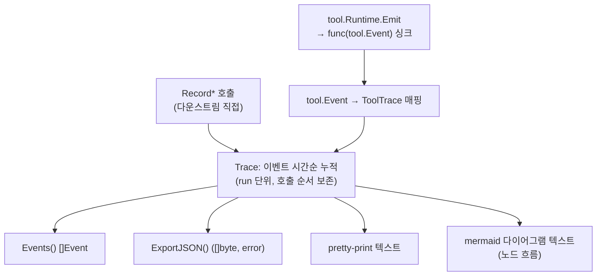

# trace — 분석·설계

`features/20260630-001-trace/spec.md`로부터 도출한 설계 분석이다. 대상은 신규 `trace` 패키지 하나다(Phase 7 분할 feature).

## 근거

### 읽은 spec 범위
- spec.md 전체 — §1 범위(타입·기록 메소드·조회/내보내기·출력·tool.Event 싱크), §2 목표, §3 제약(단방향 import·tool.Event
  싱크·외부 백엔드 미사용·기존 타입 불변·인메모리·정적 경계 검증), §4 제외(외부 추적 백엔드·UI/HTTP·다른 Phase 7
  패키지·자동 계측), §5.1~§5.7 완료 조건.

### 코드베이스에서 확인한 사실
- `tool/tool.go` — `tool.Event{ToolName string; ToolCallID string; Input Input(=json.RawMessage); Result *Result; Err error}`.
  `tool.Result{Content string; IsError bool}`. `tool.Runtime` 인터페이스의 `Emit(ev Event)`. `NewRuntime(state any,
  toolCallID string, cfg config.RunConfig, store Store, emit func(Event)) Runtime` — emit 주입 형태가 `func(tool.Event)`임을
  확인. 패키지 주석이 "store/trace 구체 타입은 참조하지 않는다(§28-1 규칙2)"를 명시.
- `graph/graph.go` — `State = core.State`, `StateUpdate = core.StateUpdate`, `StateSnapshot = core.StateSnapshot`(모두 alias).
  `core/core.go` — `State map[string]any`, `StateUpdate map[string]any`. 즉 §25의 `RecordNodeStart(node, st graph.State)`/
  `RecordNodeEnd(node, update graph.StateUpdate)`는 실질적으로 `map[string]any`를 받는다.
- `message/message.go` — `ToolCall{ID ToolCallID(=string); Name string; Args json.RawMessage}`.
- `llm/llm.go` — `ChatRequest`(Messages/Tools/ToolChoice/ResponseFormat/Model/Temperature, 48행), `ChatResponse`
  (Message/ToolCalls/Usage/FinishReason, 65행).
- 기존 경계 테스트 방식 — `a2a/import_boundary_test.go`는 `go/build`로 모듈 내부 소스를 정적 파싱(`build.ImportDir`)하고
  재귀로 전이 의존을 수집한다. `go list` 등 하위 프로세스를 띄우지 않는다(Windows 안티바이러스·빌드 캐시 잠금 회피).
  허용 집합 검사·금지 외부 의존 검사·go.mod 매니페스트 검사·하위 패키지 역참조 검사 4개 하위 테스트로 구성된다.
  `mcp`·`store`도 동일하게 `import_boundary_test.go`를 둔다.
- 패키지 디렉토리 컨벤션 — 한 디렉토리에 패키지 본문 `.go` + `_test.go` + `import_boundary_test.go`. `a2a`는 책임별로
  파일을 분리(`types.go`/`server.go`/`client.go`/`adapter.go`)한다.
- 역참조 부재(확인) — 모듈 전체에서 `langgraph-go/trace`를 import하는 파일이 없다. trace는 미구현 신규 패키지다.

### 추정(코드로 확정하지 못한 것)
- `tool.Runtime`의 동시 사용 가능성: 도구가 고루틴에서 병렬 실행되면 싱크(`emit`)가 동시에 호출될 수 있다. 현재 코드에서
  `Executor.ExecuteMany`는 순차 실행이지만, 다운스트림이 trace 싱크를 어떤 실행 경로에 연결할지는 trace가 통제하지 못한다.
  이는 Decision Point (d)의 근거다(확정 사실이 아닌 설계 판단 대상).

## 1. 구조

`trace`는 Phase 7의 선택 모듈로, 상위 패키지에 위치한다. import 방향은 `trace` → (`graph`·`message`·`llm`·`tool`·`core`·
`config` 및 그 전이 의존) → 표준 라이브러리의 단방향이다(§3). 하위 패키지는 `trace`를 역참조하지 않는다.

`trace`는 자체 `Event`/`Trace` 타입을 정의하며 `tool.Event`와 별개다(§1: "`trace`는 자체 `Event`/`Trace` 타입을 정의하며
`tool.Event`와 별개다"). 구성 요소의 경계 관계는 다음과 같다.

- **`Trace`(집합체)** — 한 run 단위로 이벤트를 시간순 누적하는 인메모리 컨테이너다. 모든 `Record*` 메소드와
  `StartRun`/`EndRun`의 수신자이며, 누적된 이벤트의 단일 소유자다. 조회(`Events`)·내보내기(`ExportJSON`)·출력
  (pretty/mermaid)의 원천이다.
- **`Event`(이벤트 단위)** — 시간순 기록의 한 항목이다. §25가 `Event`와 네 종류(`NodeTrace`/`ToolTrace`/`LLMTrace`/
  `ErrorTrace`)를 함께 나열하므로, 둘의 관계를 commit해야 한다(Decision Point (a)).
- **이벤트 종류 타입** — `NodeTrace`(노드 진입/종료), `ToolTrace`(도구 호출/결과), `LLMTrace`(LLM 요청/응답),
  `ErrorTrace`(에러). 각각 하위 패키지의 중립 타입(`graph.State`=`map[string]any`, `message.ToolCall`, `tool.Result`,
  `llm.ChatRequest`/`ChatResponse`, `error`)에서 추출한 값을 담는다.
- **출력(pretty/mermaid)** — `Trace`가 누적한 이벤트를 입력으로 받아 문자열을 산출하는 렌더링 표면이다. 외부 렌더링
  라이브러리·네트워크 없이 문자열로만 생성한다(§3). pretty는 run 구간과 모든 이벤트 종류를 사람이 읽는 텍스트로,
  mermaid는 노드 실행 흐름을 mermaid 다이어그램 텍스트로 렌더링한다(§5.4, §5.5).
- **tool.Event 싱크** — `tool.Event`를 받아 `ToolTrace`로 매핑·기록하는 `func(tool.Event)` 형태의 수신 표면이다(§1, §28-1
  규칙2). `trace`는 상위 타입으로서 `tool`을 import하지만 `tool`은 `trace`를 import하지 않는다. 싱크는 `Trace`에 종속된
  기록 경로이지 별도 저장소가 아니다.

이 패키지는 "수신 표면만 제공하고 연결은 다운스트림 책임"이라는 §4 제외(자동 계측)를 따른다. `Record*`와 싱크는
기록 입구이고, 그래프·에이전트 실행 경로에 자동 삽입하는 계측은 trace 범위 밖이다.

## 2. 데이터 흐름

### 상태 전이
`Trace`는 run 단위로 다음 상태를 가진다.

- **run 미시작** → `StartRun(runID)` → **run 진행 중**: 이후 `Record*`·싱크 유입이 현재 run에 시간순 누적된다.
- **run 진행 중** → `EndRun(runID)` → **run 종료**: run 구간이 닫힌다. pretty 출력의 "run 구간"(§5.4)은 이 시작/종료
  경계로 식별된다.
- 이벤트 누적은 호출 순서를 보존한다(§5.2: "`Events()`가 호출 순서대로 돌려준다").

### 유입 → 누적 → 출력 경로

- **유입 경로 1 (직접 기록)** — `RecordNodeStart`/`RecordNodeEnd` → `NodeTrace`, `RecordToolCall`/`RecordToolResult` →
  `ToolTrace`, `RecordLLMRequest`/`RecordLLMResponse` → `LLMTrace`, `RecordError` → `ErrorTrace`(§5.2).
- **유입 경로 2 (싱크)** — `tool.Runtime.Emit(ev)`가 `func(tool.Event)` 싱크를 호출하면, 싱크가 `tool.Event`(ToolName/
  ToolCallID/Input/Result/Err)를 `ToolTrace`로 매핑해 누적한다. 결과적으로 도구 호출/결과가 별도 수작업 `RecordTool*`
  호출 없이 `Events()`에 나타난다(§5.6).
- **누적** — 두 경로 모두 동일한 `Trace`의 이벤트 슬라이스에 append되어 시간순(호출 순서)으로 정렬된다.
- **출력** — `Events()`는 누적 슬라이스를 호출 순서로 반환한다. `ExportJSON()`은 누적 이벤트를 JSON 바이트로
  직렬화하며, round-trip 시 종류·필드 값이 보존돼야 한다(§5.3 → Decision Point (b)). pretty/mermaid는 누적 이벤트를
  순회해 문자열을 산출한다.

### 동시성
싱크(`func(tool.Event)`)는 도구 실행 경로에 연결되므로, 다운스트림이 도구를 병렬 실행하면 여러 고루틴에서 동시에
호출될 수 있다(추정 — §근거 참조). 직접 `Record*` 호출과 싱크 유입이 같은 `Trace`의 누적 슬라이스를 건드리므로
data race 위험이 있다. 동시 누적 안전성을 보장할지 여부는 Decision Point (d)에서 결정한다. 인메모리 결정적 검증
요구(§3)와 충돌하지 않는다 — 잠금은 검증 결정성과 무관하다.

### 에러 경로
- `RecordError(err)`는 정상 기록 경로다(에러를 `ErrorTrace`로 누적). `tool.Event.Err`도 싱크에서 `ToolTrace`로 매핑된다.
- `ExportJSON()`은 `error`를 반환한다(§25 시그니처). 직렬화 실패 시 에러를 전파한다.
- pretty/mermaid 출력 함수의 에러 반환 여부는 §25에 명시되지 않았다. 외부 의존 없는 순수 문자열 생성이므로
  실패 경로가 본질적으로 없다 — 시그니처는 Decision Point (c)에서 출력 범위와 함께 commit한다.

## 3. 인터페이스

경계를 가로지르는 시그니처만 기술한다. 내부 helper(매핑 함수·문자열 빌더 등)는 제외한다. §25가 메소드 시그니처를
고정하므로 그대로 따른다.

- **생성자** — `func New() *Trace`(빈 인메모리 trace 생성). 이름·인자 형태는 기존 패키지 컨벤션(`tool.NewRegistry`,
  `tool.NewExecutor`)을 따르며 Decision Point (e)의 싱크 주입 방식 결정에 종속될 수 있다.
- **run 경계** — `(*Trace) StartRun(runID string)`, `(*Trace) EndRun(runID string)`.
- **기록 메소드 군** —
  - `(*Trace) RecordNodeStart(node string, st graph.State)` / `(*Trace) RecordNodeEnd(node string, update graph.StateUpdate)`
  - `(*Trace) RecordToolCall(call message.ToolCall)` / `(*Trace) RecordToolResult(res tool.Result)`
  - `(*Trace) RecordLLMRequest(req llm.ChatRequest)` / `(*Trace) RecordLLMResponse(resp llm.ChatResponse)`
  - `(*Trace) RecordError(err error)`
- **조회·내보내기** — `(*Trace) Events() []Event`, `(*Trace) ExportJSON() ([]byte, error)`.
- **출력** — pretty-print 출력과 mermaid 출력. 메소드(`(*Trace) Pretty() string` / `(*Trace) Mermaid() string`) 형태가
  `Trace`를 수신자로 두는 다른 조회 메소드와 일관된다. 정확한 이름·반환 형태는 Decision Point (c)에서 commit한다.
- **tool.Event 싱크** — `tool.Event`를 받아 내부 기록으로 매핑하는 `func(tool.Event)`. `tool.NewRuntime(..., emit func(Event))`의
  `emit` 인자에 직접 대입 가능한 형태여야 한다(§5.6). 메소드 값(`t.ToolEventSink`) vs 싱크 반환 함수(`(*Trace) ToolSink()
  func(tool.Event)`) vs 생성자 주입은 Decision Point (e)에서 결정한다.

`Event`·`NodeTrace`/`ToolTrace`/`LLMTrace`/`ErrorTrace`의 구체 형태(필드·관계)는 Decision Point (a),(b)에서 commit한다.

## 4. 영향 범위

- **신규 추가** — `trace/` 패키지 디렉토리와 그 안의 본문·테스트 파일. import_boundary_test.go(정적 경계 검증)를
  포함한다.
- **수정 안 함** — Phase 0~6 패키지 전부. §3·§5.1·§5.7이 기존 타입·동작 불변을 요구한다. 특히 `tool.Event`/
  `tool.Runtime`/`tool.NewRuntime`은 이미 `func(Event)` emit 주입 표면을 갖고 있어 trace 싱크를 그대로 연결할 수 있다 —
  `tool`을 수정할 필요가 없다.
- **역참조 확인** — 모듈 전체에서 `langgraph-go/trace`를 import하는 파일이 없음을 확인했다(grep). trace는 미구현
  신규 패키지이므로 하위 패키지가 trace를 역참조하는 경로가 존재하지 않는다. §5.7의 역참조 부재 단정은 신규
  패키지 추가 후에도 정적 검사로 회귀 보호된다.
- **자동 계측 없음** — §4 제외에 따라 `graph`·`agent` 실행 경로에 trace 호출을 삽입하지 않는다. 연결은 다운스트림 책임이다.

## 5. Decision Points

### (a) 이벤트 표현 — `Event`와 4종 타입의 관계
- 옵션 1: 단일 `Event` 구조체 + `Kind` 필드 + 종류별 페이로드 필드(Node/Tool/LLM/Error)를 한 타입에 모음.
- 옵션 2: 종류별 타입(`NodeTrace` 등)을 정의하고 `Event`가 그것을 감싸는 래퍼(공통 메타 + 종류 페이로드).
- 옵션 3: `Event`를 인터페이스로 두고 `NodeTrace`/`ToolTrace`/`LLMTrace`/`ErrorTrace`가 구현.
- **채택: 옵션 2.** `Event`는 공통 메타(종류 판별 + 순서)를 담고 종류별 타입을 페이로드로 감싼다. `Events() []Event`가
  단일 구체 타입 슬라이스를 반환해야 하므로(§25) 인터페이스(옵션 3)보다 값 슬라이스가 단순하고, JSON round-trip
  (§5.3)에서 인터페이스 역직렬화의 타입 손실 문제를 피한다. §25가 `Event`와 4종 타입을 **모두** 나열하므로 둘 다
  존재해야 한다 — 옵션 1은 4종 타입을 독립 타입으로 두지 않아 §25 표면과 어긋난다. 옵션 2가 `Event`(상위) + 4종
  타입(페이로드)을 모두 만족한다.
- 근거: §5.2(종류별 이벤트 기록 + 호출 순서), §5.3(round-trip 보존), §25 타입 목록.

### (b) JSON 직렬화의 종류 판별(union)
- 옵션 1: `Event`에 `Kind` 판별 필드를 두고, 비어 있는 종류 페이로드는 `omitempty`로 생략. 역직렬화 시 `Kind`로
  어느 페이로드가 유효한지 판별.
- 옵션 2: 커스텀 `MarshalJSON`/`UnmarshalJSON`으로 종류별 union 인코딩.
- **채택: 옵션 1.** §5.3은 round-trip 시 "종류·필드 값 보존"만 요구한다. 옵션 1처럼 `Event`가 명시적 `Kind` 필드와
  종류별 페이로드 필드를 가지면, 표준 `encoding/json`만으로 `Kind`가 보존되고 채워진 페이로드 필드의 값이 보존된다 —
  커스텀 마샬러 없이 round-trip이 성립한다. `error`는 표준 JSON으로 직렬화되지 않으므로 `ErrorTrace`는 에러 메시지를
  문자열 필드로 보관한다(round-trip 보존 대상은 그 문자열 값). 노드 상태(`graph.State`=`map[string]any`)의 임의 값은
  표준 JSON 규칙을 따른다(숫자가 float64로 복원되는 등) — round-trip 보존 단정은 이 규칙 안에서 성립하는 값으로 검증한다.
- 근거: §5.3, (a) 채택 결과.

### (c) mermaid 출력 흐름 범위 + pretty/mermaid 시그니처
- **채택: mermaid는 노드 실행 흐름만 표현한다.** §5.5가 "노드 진입/종료 순서가 mermaid 문법의 노드·엣지로 표현"을
  요구하므로, mermaid 렌더링은 `NodeTrace` 이벤트(진입/종료)를 순서대로 노드·엣지로 변환한다. 도구·LLM·에러
  이벤트는 mermaid 흐름에 포함하지 않는다(§5.5가 노드 흐름만 명시). pretty는 §5.4대로 run 구간 + 모든 이벤트 종류를
  텍스트로 렌더링한다. 출력 함수는 외부 의존 없는 순수 문자열 생성이라 실패 경로가 없으므로 `error`를 반환하지
  않는 `(*Trace) Pretty() string` / `(*Trace) Mermaid() string` 형태로 commit한다.
- 근거: §5.4, §5.5, §3(문자열로만 생성).

### (d) 동시성 안전성
- 옵션 1: `Trace`에 mutex를 두고 기록·조회를 직렬화.
- 옵션 2: 잠금 없이 단일 고루틴 사용을 전제(문서화).
- **채택: 옵션 1.** tool.Event 싱크는 `tool.Runtime.Emit`에 연결되며, 다운스트림이 도구를 병렬 실행하면 싱크가 여러
  고루틴에서 동시 호출될 수 있다(추정 — §근거). 싱크와 직접 `Record*`가 같은 누적 슬라이스를 건드리므로, 최소
  비용의 mutex로 누적·조회를 보호하는 편이 안전하다. 잠금은 인메모리·결정적 검증(§3)과 충돌하지 않으며 외부
  의존도 추가하지 않는다. 기록 빈도가 낮은 추적 용도라 단일 mutex의 성능 비용은 무시할 수준이다.
- 근거: §1 싱크 연결 표면, §5.6, §3.

### (e) tool.Event 싱크 형태
- 옵션 1: 메소드 값 — `t.ToolSink`(메소드 `func (t *Trace) ToolSink(ev tool.Event)`)를 `func(tool.Event)`로 전달.
- 옵션 2: 싱크 반환 함수 — `(*Trace) ToolEventSink() func(tool.Event)`가 클로저를 반환.
- 옵션 3: 생성자 주입 — `New`가 싱크를 미리 만들어 보관.
- **채택: 옵션 2.** `tool.NewRuntime(..., emit func(Event))`의 `emit` 인자에 그대로 대입 가능한 `func(tool.Event)` 값을
  명시적으로 제공하므로 연결 지점이 명확하다(§5.6). 메소드 값(옵션 1)도 동작하지만, 반환 함수가 "이 함수를 emit에
  꽂으라"는 의도를 시그니처로 드러내고, 필요 시 매핑 로직을 클로저 안에 캡슐화할 여지를 준다. 생성자 주입(옵션 3)은
  `New`의 시그니처를 복잡하게 만들고 §25의 단순 생성 표면과 어긋난다.
- 근거: §5.6, `tool.NewRuntime` 실제 시그니처(emit func(Event)).

### (f) 경계 테스트 정적 분석 방식
- **채택: 기존 `a2a`/`mcp`/`store`의 `import_boundary_test.go` 방식을 그대로 따른다.** `go/build`의 `build.ImportDir`로
  모듈 내부 소스를 정적 파싱하고 전이 의존을 재귀 수집한다. `go list` 등 하위 프로세스를 띄우지 않는다(Windows
  안티바이러스·빌드 캐시 잠금 회피, §3). 검사 항목은 (1) `trace`의 모듈 내부 의존이 허용 집합(`graph`·`message`·`llm`·
  `tool`·`core`·`config` + 전이 의존) 이내, (2) 하위 패키지(`graph`·`tool`·`message`·`llm`·`core`·`config`)의 전이 의존에
  `trace` 부재(역참조 금지)다. trace는 외부 SDK 금지 요구가 없으므로 a2a식 forbidden-prefix·go.mod 매니페스트 검사는
  필요한 범위로만 둔다(외부 백엔드 미사용을 보호하려면 차용 가능).
- 근거: §5.7, §3, `a2a/import_boundary_test.go` 실제 구조.
