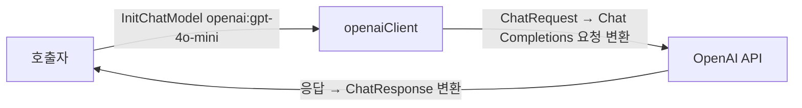

# textbook-parity ANALYSIS

## 근거

읽은 spec 범위: `features/20260702-001-textbook-parity/spec.md` 전체(§1~§5).
코드베이스에서 확인한 사실:

- `llm/llm.go` — `Client` 인터페이스(Chat/ChatStream/Structured/BindTools/
  ParseToolCalls/WithModel/ModelName), `InitChatModel`은 `provider:model` 파싱 후
  `anthropic` 분기만 존재. `Option`은 `WithAPIKey`/`WithDefaultModel` 두 개.
- `llm/anthropic_adapter.go` — 공식 Anthropic Go SDK(`anthropics/anthropic-sdk-go`)
  기반. SDK 타입은 파일 내부에만 두고 공개 API에 노출하지 않는 패턴. API 키 미지정 시
  SDK가 `ANTHROPIC_API_KEY` 환경변수를 자동 사용. `Structured`는 도구 강제 방식.
- `llm/embedding.go` — `EmbeddingClient`(Embed/EmbedQuery), `InitEmbeddings`는
  `ollama` 분기만 존재. Ollama 구현체는 SDK 없이 표준 `net/http` 직접 호출
  (`POST {base}/api/embed`), 연결 실패·비정상 상태코드·빈 응답을 error로 반환.
- `llm/stub.go` — 네트워크 없는 `StubClient`가 `Client` 계약 테스트를 담당.
- `llm/llm_test.go:289-295, 313-326` — `openai:gpt-4o`가 **미지원 프로바이더 테스트의
  입력**으로 들어 있어, openai 분기 추가 시 이 테스트들이 실패한다(수정 필요).
  `llm/embedding_test.go:36-50`도 `openai:text-embedding-3-small`을 미지원 목록에 포함.
- `vectorstore/vectorstore.go` — `Store`(Add/SimilaritySearch/AsRetriever),
  `Retriever`(Invoke), `InMemoryStore`, `FromDocuments`. `SearchOptions{K, Filter}`.
- `vectorstore/supabase.go` — `SupabaseVectorStore`는 `Store` 전체가 아니라
  `MatchDocuments`+`AsRetriever`만 가진 얇은 어댑터로, pgvector 접근은 전부
  `database.Client`에 위임. 적재는 `database.InsertDocumentChunks` 경로.
- `vectorstore/retriever_tool.go` — `CreateRetrieverTool(r Retriever, name, desc)`가
  `Retriever` 인터페이스만 받으므로 새 백엔드가 `AsRetriever`만 제공하면 재사용된다.
- `vectorstore/import_boundary_test.go` — go/build 정적 파싱으로 경계 검사.
  `github.com/amikos-tech/chroma-go`·`supabase-community/supabase-go`를 **금지 외부
  SDK로 명시**. vectorstore는 document·llm·tool·database import 필수,
  database→vectorstore 역참조 금지.
- `database/client.go` — `Client` 계약. `MatchDocuments(ctx, []float32, count)`는
  `match_documents` RPC 호출, 벡터 차원은 Go 타입(`[]float32`)에 고정돼 있지 않다.
  DDL·마이그레이션은 미소유(스키마 존재 가정, 호출만).
- `database/schema.sql` — 코드가 실행하지 않는 참고 자산(수동 1회 실행).
  `vector(768)` 3곳(documents.embedding, match_documents 인자·반환).
  헤더 주석에 "교재 CHAP11 index.sql 원본은 VECTOR(1536), 이 레포는 768로 개정"이라
  명시. `match_documents(query_embedding, match_count)` 시그니처는 교재와 동일.
- `database/integration_test.go` — `DATABASE_URL` 부재 시 `t.Skip` 패턴.
  `vectorstore/e2e_test.go` — Ollama 서버 도달 불가·모델 미설치 시 `t.Skip` 패턴.
- `config/config.go` — `Config.OpenAIAPIKey`가 **이미 존재**하고 `LoadEnv`가
  `OPENAI_API_KEY`를 읽는다. 코드 수준의 "기본 프로바이더" 값은 없다
  (`InitChatModel`은 항상 명시 spec 필요, `parseProviderSpec`이 빈 model 거부).
  `.env.example` 파일은 레포에 없다.
- `go.mod` — OpenAI Go SDK 없음, Chroma Go 클라이언트 없음(신규 의존성 결정 필요).
  Anthropic SDK·pgx·pgvector-go는 존재.
- 레포 루트 `README.md` — §4(llm)에 "챗은 Anthropic 기준, OpenAI 챗은 구현 범위 밖",
  §16(vectorstore)·§28에 "Chroma 백엔드 제외 확정", §26 후순위 목록에
  "OpenAI 외 프로바이더" 문구. §4의 팩토리 예시 줄(166)은 이미 `openai:gpt-4o` 형식을
  예로 쓰고 있다. 갱신 대상: §1 구조도(36행), §4, §16, §26, §28, §28-1 경계 서술.

추정(미확인): Chroma v2 REST의 정확한 엔드포인트 경로·요청 필드는 공식 문서 기준으로
서술했으며, 구현 시 실 서버(chromadb 1.x)에 대해 확정한다.

## 1. 구조

새 모듈은 필요 없다. 전부 기존 패키지 내 구현체 추가로 끝난다.

- `llm/` — `openai_adapter.go`(챗 Client 구현체)·`openai_embedding.go`
  (EmbeddingClient 구현체) 추가. `InitChatModel`/`InitEmbeddings`의 switch에
  `openai` 분기 추가. 기존 anthropic·ollama 코드는 수정하지 않는다(SPEC §3).
- `vectorstore/` — `chroma.go` 추가. `ChromaVectorStore`가 `Store` 3메서드를 모두
  구현해 `InMemoryStore`와 같은 계약 위치에 선다(SPEC §5.3). Chroma 접근은 Ollama
  임베딩 전례를 따라 `net/http` 직구현으로 하며(§5 D-c), import 경계 테스트의
  금지 SDK 목록(`amikos-tech/chroma-go`)은 그대로 유지된다.
- `database/` — Go 코드 무변경. `schema.sql`의 차원만 1536으로 전환(§5 D-d).
  `MatchDocuments` 경로는 `[]float32`라 차원 중립이며 시그니처 변경이 없다.
- `config/` — 무변경. `OpenAIAPIKey` 로딩이 이미 있다.
- 문서 — 레포 README의 프로바이더 기준·Chroma 제외 선언을 갱신(SPEC §5.6).

의존 방향은 기존 경계를 그대로 따른다: 새 OpenAI 구현체는 llm 내부에 갇히고
(SDK 타입 비노출 — anthropic 어댑터와 동일 패턴), ChromaVectorStore는
document·llm 표준 의존만 추가하므로 vectorstore의 경계 테스트를 통과한다.

## 2. 데이터 흐름

### 2.1 OpenAI 챗 경로 (SPEC §5.1)



- 일반 대화: `Chat` → Chat Completions 호출 → `ChatResponse{Message, Usage,
  FinishReason}` 변환.
- 도구 바인딩·호출: `BindTools`로 `tool.Schema` → OpenAI function tool 변환,
  응답의 `tool_calls`를 `message.ToolCall`로 파싱해 `ChatResponse.ToolCalls`에 채움.
- 토큰 스트리밍: `ChatStream` → SSE 스트림의 델타를 `ChatEventToken`으로,
  완성 메시지를 `ChatEventMessage`, 종료를 `ChatEventDone`으로 방출(기존 이벤트 계약).
- 구조화 출력: `Structured` → `response_format: json_schema`(OpenAI 네이티브
  Structured Outputs) 사용 후 JSON 파싱해 `any` 반환(§5 D-a 참고).
- 에러 경로: API 키 부재 시 요청 시점에 인증 에러가 error로 반환된다.
  `InitChatModel` 자체는 네트워크를 타지 않으므로 키 없이도 생성은 성공한다
  (anthropic 어댑터와 동일 — 빌드·단위테스트 무결, SPEC §3).

### 2.2 OpenAI 임베딩 경로 (SPEC §5.2)

호출자 → `InitEmbeddings("openai:text-embedding-3-small")` → `Embed`/`EmbedQuery`
→ OpenAI Embeddings API → `[][]float32`(1536차원) 반환. 입력 순서 = 출력 순서 보장.
키 부재·연결 실패·빈 응답은 Ollama 구현과 같은 방식으로 error 반환.

### 2.3 Chroma add/search 경로 (SPEC §5.3)

- Add: `docs` → `emb.Embed`(클라이언트 측 임베딩 — 교재의 LangChain Chroma와 동일
  분담) → `POST .../collections/{id}/add`(ids, embeddings, documents, metadatas).
- SimilaritySearch: `query` → `emb.EmbedQuery` → `POST .../collections/{id}/query`
  (query_embeddings, n_results=K, where=Filter) → 응답의 documents/metadatas를
  `document.Document`로 변환.
- AsRetriever/Invoke: 고정 `SearchOptions`로 SimilaritySearch에 위임
  (InMemory·Supabase retriever와 동일 구조). `CreateRetrieverTool` 재사용 가능.
- 에러 경로: 서버 미기동 시 연결 에러를 error로 반환. 생성자는 네트워크를 타지
  않거나(지연 초기화) 실패를 error로 돌려 빌드·테스트 무결을 지킨다(SPEC §3).
  e2e 테스트는 heartbeat 확인 후 미도달 시 skip(§5 D-f).

### 2.4 Supabase 1536 적재·조회 경로 (SPEC §5.4)

적재: 문서 청크 → OpenAI 임베딩(1536) → `database.InsertDocumentChunks` →
`documents.embedding vector(1536)`.
조회: 질의 → `EmbedQuery`(1536) → `SupabaseVectorStore.MatchDocuments` →
`database.MatchDocuments` → `match_documents(vector(1536), int)` RPC → 상위 K 변환.
Go 코드는 차원 중립이라 무변경이며, 차원 불일치(예: 768 벡터로 질의)는 pgvector가
DB 에러로 돌려주고 그대로 error 전파된다. 기존 768 데이터는 폐기·재적재
(2026-07-02 확정, spec §3) — 테이블 drop/재생성으로 전환한다.

## 3. 인터페이스

- `llm.Client` 계약 충족: `openaiClient`가 7개 메서드를 전부 구현한다.
  `BindTools`/`WithModel`은 anthropic 어댑터와 동일한 불변 빌더 패턴(새 인스턴스
  반환). 기존 시그니처 변경 없음(SPEC §3).
- `llm.EmbeddingClient` 계약 충족: `openaiEmbeddingClient`가 Embed/EmbedQuery 구현.
- 스펙 문자열 확장: `InitChatModel` switch에 `case "openai"` 추가
  (`openai:<model>`, SPEC §5.1), `InitEmbeddings`에 `case "openai"` 추가
  (`openai:text-embedding-3-small`, SPEC §5.2). 미지원 프로바이더 에러 메시지의
  지원 목록 문구를 갱신한다. API 키는 `WithAPIKey` 옵션 → 없으면 SDK의
  `OPENAI_API_KEY` 환경변수 자동 사용(anthropic과 동일 규약).
- `vectorstore.Store` 계약 충족: `ChromaVectorStore`가 Add/SimilaritySearch/
  AsRetriever를 구현해 `Store` 인터페이스에 대입 가능(InMemoryStore와 동급).
  `Retriever`는 기존 인터페이스 그대로.
- Chroma HTTP 계약: chromadb 1.x의 **v2 REST API**(v1은 1.x에서 제거됨) 기준.
  사용 범위는 heartbeat(가용성 확인), collection get-or-create,
  `/add`, `/query` 4종 수준으로 한정하고, tenant/database는 기본값
  (default_tenant/default_database)을 쓴다. 정확한 경로·필드는 구현 시 실 서버로
  확정한다(§근거의 추정 항목).
- 1536 DDL 함수 시그니처(SPEC §5.4): 교재 원본과 동일하게 복원된다.

  ```sql
  match_documents(query_embedding vector(1536), match_count int)
  returns table (content text, embedding vector(1536), filename text,
                 storage_ref text, chunk_index int, document_type text)
  ```

  인자 시그니처·호출 형태(`SELECT ... FROM match_documents($1, $2)`)는 현행과
  동일하므로 `database/query.go`와의 컬럼 계약도 그대로 유지된다.

## 4. 영향 범위

- `llm/llm.go` — switch 분기·에러 메시지. `llm/embedding.go` — switch 분기·에러
  메시지(ollama 구현부는 무변경).
- `llm/llm_test.go` — `TestInitChatModel_UnsupportedProvider`(289행)와
  `TestInitChatModel_MultipleProviders`(313행)가 `openai:*`를 미지원 입력으로 사용
  중 → openai 항목 제거·대체 필요. `llm/embedding_test.go` —
  `TestInitEmbeddings_UnsupportedProvider`(37행)의 `openai:text-embedding-3-small`
  제거 필요. 이 수정 없이는 SPEC §5.5(기존 테스트 전부 통과)가 성립하지 않는다.
- `llm/` 신규 — openai 챗·임베딩 구현체와 단위 테스트(stub·파싱 테스트 패턴).
- `go.mod` — OpenAI 공식 Go SDK 의존성 추가(§5 D-a).
- `vectorstore/` 신규 — `chroma.go`와 테스트. `import_boundary_test.go`는 무변경
  (REST 직구현이므로 금지 목록 그대로 통과 — §5 D-c).
- `database/schema.sql` — `vector(768)` 3곳 → `vector(1536)`, 헤더 주석 개정.
  Go 파일 무변경. DB `documents` 테이블 — 기존 768 데이터 폐기·재적재(사용자 확정).
- `config/` — 해당 없음(`OpenAIAPIKey` 기존재 확인).
- 레포 `README.md` — §1 구조도(vectorstore 줄의 "Chroma 제외" 문구), §4 프로바이더
  분담 note(기본 기준 OpenAI, Anthropic/Ollama 대체 경로), §16 Chroma 제외 선언
  해제·백엔드 목록 갱신, §26 후순위 목록, §28 Chroma 제외 항목(SPEC §5.6, §1).
- 호출자 영향: `NewSupabaseVectorStore`·`CreateRetrieverTool`·`InitEmbeddings`의
  레포 내 호출자는 각 패키지 테스트뿐임을 grep으로 확인 — 런타임 호출 코드 파급 없음.

## 5. Decision Points

### D-a. OpenAI 챗 구현 방식 — 공식 openai-go SDK 채택

- 옵션: ① 공식 `openai-go` SDK 의존성 추가 ② `net/http` 직구현.
- 트레이드오프: ①은 신규 의존성이 늘지만 스트리밍(SSE 델타 조립)·tool_calls·
  Structured Outputs를 SDK가 담당하고, 기존 anthropic 어댑터(공식 SDK 사용,
  SDK 타입 내부 은닉)와 구현 패턴이 대칭이 된다. ②는 의존성 zero지만 SSE 파싱과
  도구 호출 델타 병합을 자체 구현·유지해야 해 결함 표면이 크다.
- 채택: ① 공식 SDK. SDK 메이저 버전 고정은 구현 시점 최신 안정판으로 확정한다.
- 근거: 챗 계약은 스트리밍·도구·구조화까지 4개 축(SPEC §5.1)을 모두 요구해
  직구현 비용이 크고, 레포 전례가 "챗=공식 SDK(anthropic), 단순 HTTP=직구현
  (ollama)"로 이미 갈라져 있다. 챗은 전자에 해당한다.

### D-b. 임베딩 클라이언트 분리 — 같은 패키지, 별도 구현체, SDK 공유

- 옵션: ① 챗 클라이언트에 임베딩 메서드까지 묶은 단일 타입 ② 챗/임베딩을 별도
  타입으로 두되 같은 SDK 클라이언트 생성 규약 공유.
- 트레이드오프: ①은 타입 수가 적지만 `Client`와 `EmbeddingClient`가 별개 계약이라
  인터페이스 오염 없이 묶을 방법이 없다. ②는 파일이 하나 늘지만 기존 구조
  (챗 `anthropicClient` / 임베딩 `ollamaEmbeddingClient` 분리)와 정합한다.
- 채택: ② 별도 구현체. 임베딩도 같은 openai-go SDK를 사용한다(의존성 재활용).
- 근거: 계약 인터페이스가 애초에 분리돼 있고(SPEC §3 하위호환), 기존 코드가 이미
  이 분리를 따른다.

### D-c. Chroma 연동 — net/http 직구현, v2 REST API

- 옵션: ① 서드파티 `amikos-tech/chroma-go` 채택 ② `net/http`로 v2 REST 직구현.
- 트레이드오프: ①은 API 추적을 위임하지만 비공식 서드파티 성숙도 리스크가 있고,
  현행 `vectorstore/import_boundary_test.go`가 이 패키지를 금지 목록으로 명시해
  경계 테스트 완화가 필요해진다. ②는 add/query 요청·응답 스키마를 직접 관리해야
  하지만 사용 표면이 4개 엔드포인트 수준으로 작고, Ollama 임베딩의 net/http 직구현
  전례와 일치하며 경계 테스트를 무수정으로 유지한다.
- 채택: ② REST 직구현, 대상은 chromadb 1.x가 제공하는 v2 API(v1은 제거됨).
- 근거: 필요 표면이 작고, 금지 SDK 경계 테스트(회귀 자산)를 건드리지 않는 쪽이
  SPEC §5.5(회귀 없음)에 유리하다.

### D-d. Supabase 1536 전환 — 기존 schema.sql 제자리 개정

- 옵션: ① `schema.sql`을 1536으로 수정 ② 별도 마이그레이션 SQL 신규 추가.
- 트레이드오프: ①은 이력이 git에만 남지만 "수동 1회 실행 참고 자산"이라는 파일
  성격과 맞고, 교재 원본(1536) 복원이므로 파일 헤더의 개정 사유 주석을 제거·갱신
  하면 된다. ②는 768→1536 전환 절차가 파일로 남지만 스펙이 이원 병행을 제외했고
  (spec §4) database 패키지는 DDL 미소유라 마이그레이션 체계 자체가 없다.
- 채택: ① 제자리 개정 + 전환 안내(기존 테이블 drop 후 재실행) 주석 한 줄.
  시그니처는 `match_documents(vector(1536), int)`로 교재 원본과 일치(SPEC §5.4).
- 근거: 768 데이터 폐기가 확정됐고(spec §3), 파일이 코드 비실행 참고 자산이라
  마이그레이션 체계 도입은 과잉이다.

### D-e. 기본 프로바이더 전환의 표현 — 문서 기준 갱신, 코드 기본값 신설 없음

- 옵션: ① 코드에 전역 기본 프로바이더 도입(spec 생략 시 openai) ② 문서·예시만
  OpenAI 기준으로 갱신.
- 트레이드오프: ①은 교재 감각에 더 가깝지만 현행 `InitChatModel`은 명시
  `provider:model`을 항상 요구하고(빈 spec은 파싱 에러) 코드 어디에도 전역 기본값이
  없음을 확인했다 — 기본값 신설은 기존 에러 계약을 바꾸는 스펙 밖 확장이다.
  ②는 코드 무변경으로 SPEC §3(하위호환)과 정확히 맞는다.
- 채택: ② 문서 기준 갱신. README §4·§16·§26·§28에서 기준 프로바이더를 OpenAI로,
  Anthropic/Ollama를 명시 지정 대체 경로로 기술한다(SPEC §5.6).
- 근거: "기본"이 코드에 존재하지 않음을 확인했고, spec §1도 "레포 문서의 기본
  프로바이더 기준 갱신"으로 명시한다.

### D-f. 키/서버 부재 시 무결 — 기존 skip 패턴 동일 채택

- 옵션: ① 기존 패턴 재사용(환경 확인 후 `t.Skip`) ② build tag 분리.
- 트레이드오프: ①은 레포에 이미 두 전례(`DATABASE_URL` 부재 skip, Ollama heartbeat
  실패 skip)가 있어 일관되고 `go test ./...` 한 번으로 전체가 돈다. ②는 명시성이
  높지만 레포에 전례가 없고 실행 절차가 갈라진다.
- 채택: ① 동일 패턴. OpenAI 경로는 `OPENAI_API_KEY` 부재 시 skip, Chroma 경로는
  heartbeat 미도달 시 skip. 파싱·계약 단위 테스트는 네트워크 없이 항상 실행
  (기존 `InitEmbeddings` 파싱 테스트 패턴).
- 근거: SPEC §3의 "키·서버 부재 환경에서도 빌드·테스트 무결"을 기존 회귀 자산과
  같은 방식으로 충족한다.
